# P4 report: 起動メニューと書き出し

対象: `flash/app/tool/picorabbit.app.rb`、
`lib/add/picoruby-fmrb-picorabbit/mrblib/picorabbit_renderer.rb`、
GFX 命令一式 (core と graphics-audio の両方)、`flash/home/slides/intro_ja.md`。
指示書は `doc/picorabbit/instruction_p4.md`。画像は `report/p4/`。

作業は 2 回に分かれている。T1-T4 の実装と sim 検収を行ったあと、別のセッションが
引き継いで**不具合 4 件** (書き出しの完了判定、番号付きリスト、ルビ行のマーカー、
書き出しに焼き込まれるカーソル) を直し、検収を取り直した。以下は取り直したあとの
記述で、直した箇所にはその旨を書いてある。

## T1: GFX 命令 `EXPORT_FRAME`

**番号は 0x33**。CLEAR(0x30) / FILL_SCREEN(0x31) / PRESENT(0x32) の並びの次で、
命令の意味 (フレーム単位の操作) と置き場所が揃う。**両リポジトリの
`fmrb_link_protocol.h` に同じ値**を足した。ペイロードは
`LOAD_SPRITE_IMAGE_BMP` から image_id を落とした形 (`path_len` + パス文字列)。

core 側の経路:

| 層 | 追加 |
|---|---|
| `components/fmrb_common/include/fmrb_link_protocol.h` | `FMRB_LINK_GFX_EXPORT_FRAME = 0x33`、`fmrb_link_graphics_export_frame_t` |
| `components/fmrb_msg/fmrb_gfx_msg.h` | `GFX_CMD_EXPORT_FRAME` と `params.export_frame.path[120]` |
| `components/fmrb_gfx/fmrb_gfx_cmd.[ch]` | `fmrb_gfx_cmd_export_frame(_n)` |
| `main/kernel/host/host_task.c` | バッチ 1 件への変換 |
| `lib/add/picoruby-fmrb-app/ports/esp32/gfx.c` | `FmrbGfx#_export_frame(path)` |
| `lib/add/picoruby-fmrb-app/mrblib/fmrb-gfx.rb` | `export_frame(path)` (present は含まない) |

**Spinel 側 (`fmrb_spx_gfx.c`) には足していない**。PicoRabbit は mruby 専用で、
Spinel の生成対象ではないため (指示書どおり)。

### 実機 (display_p4 / Tab5)

`display_p4_task.cpp` に `export_frame_jpeg()` を足した。要点は 3 つ。

1. **命令は描画と同じタスクで処理され、描画は遅延・ペーシングされている**ので、
   EXPORT_FRAME が来た時点では直前の present はまだフレームバッファに
   届いていない。ハンドラの中で `g_needs_render` を見て
   `render_frame()` をペーシング外で 1 回回してから撮る。
2. 画素は `g_framebuffer->getBuffer()` から直接取る (remote desktop の
   capture と同じ RGB565、**カーソルを焼き込む前**)。よって書き出した絵に
   マウスポインタは入らない。capture バッファ (単一リーダ) は使っていないので
   配信中でも取り合いにならない。
3. 符号化は `rd_encoder_jpeg`、品質 90。同期処理 (符号化と `fwrite` を
   終えてから次の命令へ)。短い書き込みになったらファイルを消してエラーにする。

**エンコーダの排他**: `rd_task.c` には排他が無く、JPEG エンコーダを使うのは
`rd_http.c` の MJPEG 配信タスクだけだった (rd_stream は H.264)。しかし
エンコーダは**ステージングと出力のバッファを 1 本ずつしか持たず、出力は
「次の encode まで呼び出し側のもの」**なので、encode だけを守っても足りない。
`rd_encoder_jpeg_lock/unlock` を足し、

- MJPEG 配信は **encode から `httpd_resp_send_chunk` を撃ち終わるまで**保持、
- export は lock → init → `rd_encoder_jpeg_encode_q(.., 90, ..)` → 書き込み →
  unlock、
- `rd_http_start/stop` の init/deinit も同じロックで囲む

とした。品質は `rd_encoder_jpeg_encode_q()` で呼び出しごとに渡す形にしたので、
配信が 80 で走っていても export だけ 90 で焼ける (init 済みなら再初期化しない)。
export は remote desktop が起動していなくてもエンコーダを自前で init する。

### sim (graphics-audio)

`graphics_handler.cpp`:

- `graphics_handler_render_frame_internal()` を
  **`compose_screen_buffer()` (合成のみ) と push の 2 段に割った**。
  EXPORT_FRAME はコマンド処理タスクで走るので、`g_lgfx` (SDL) へ押す側を
  呼ぶわけにはいかない。合成だけを `g_canvas_mutex` を取って 1 回回し、
  その結果のバッファから撮る。
- **24bit BMP を自前で書く** (ヘッダ 54 バイト、ボトムアップ、4 バイト
  パディング)。画素は `readRect(..., (lgfx::rgb332_t *)row)` で RGB332 のまま
  読む — **`readPixel` は sprite の深度に関わらず RGB565 を返す**ので、
  最初これで書いたら画面全体が別の色になった (下記)。
- **書き出す絵にカーソルは入れない** (`compose_screen_buffer(false)`)。実機側は
  カーソルを焼き込む前のフレームバッファから撮っており、それに揃えた。合成の
  ついでにカーソル下の背景を保存してしまう副作用も避けられる (保存を書き換えると
  画面側のカーソル復元が狂う)。
- パスの親ディレクトリはこちらで掘る (`mkdir` を順に)。core 側の
  `Dir.mkdir` は sim では別のファイルシステムに効くため。
- WROVER / Retro (`#else`) は `EXPORT_FRAME: NOT_SUPPORTED` を 1 行出して無視。

## T2: 起動メニュー

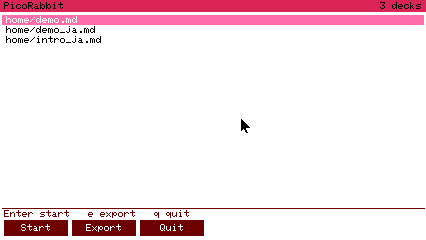

- デッキ一覧は `/home/slides/*.md` と `/mnt/sd/slides/*.md`。表示は
  `場所/ファイル名`、場所ごとにファイル名順。SD が無ければ後者は黙って 0 件
  (`no decks under /mnt/sd/slides` を info で 1 行)。
- 一覧は索引モードと同じ作法: 1 行 1 件 (size 1)、選択行は反転
  (THEME_HIGHLIGHT + THEME_TEXT_LIGHT)、Up/Down/PgUp/PgDn/Home/End、
  **行のタップは選択まで** (発表を始めるのは Start の仕事)。行数は画面高から
  決めるので 240px では 18 行、超えるとスクロールする。
- ボタンは FmrbUI の `Start` / `Export` / `Quit`。Enter は Start と同じ。
  `e` で Export、`q` / Esc で終了。
- **発表中の Esc はメニューへ戻る**、`q` だけがアプリ終了。メニューへ戻る
  ときはスプライトを隠す。
- **Start は毎回仕切り直す**: 同じデッキでも先頭のスライドに戻り
  `reset_timer` する。デッキが変わったときだけ再パース + スプライト読み直し
  (`ensure_deck`)。
- ボタンの上の 1 行は、言うことがあるときは状態 (Export が無効な理由、
  書き出しの結果)、無いときは操作のヒント。

## T3: 書き出し

- 出力先は `/mnt/sd/picorabbit/<デッキ名>/`、ファイル名は `01` から
  (100 枚以上なら 3 桁)。**拡張子はプラットフォームに従う**:
  実機は `.jpg`、sim は `.bmp` (display 側が書く形式が違うため)。
- 各スライドは最終状態: `@step = @max_step`、うさぎ・亀は隠す、
  残り時間は隠す (renderer に `clock_hidden` を足した。一時停止中でも
  必ず消える)、ページ番号とトラック線は残す。
- 1 枚あたり `render_slide` (中で present) → `export_frame(path)` の順。
- **書き出す前に同名のファイルを消す** (実機のみ)。前回の書き出しが残っていると
  `File.exist?` が即座に真を返し、待ちが待ちにならない — アプリが display を
  追い越して進み、失敗した書き込みも成功に見える。
- 完了待ち: **実機は 1 枚ごとに `File.exist?` (上限 10 秒)**。指示書は
  「最後のファイル」だったが、毎枚待つほうが命令キューの詰まりにも強く、
  条件は包含する。sim は core から見えないので 1 枚 200ms の固定待ち。
- 進捗は `Exporting 3/11 ...` を画面下に 1 行。**メニューの上ではなく、
  今書いたスライドの上に出る** — 絵を撮るにはそのスライドが画面に出ている
  必要があり、メニューは残せないため。終わったら結果をメニューの状態行に
  出す (`11 files -> /mnt/sd/picorabbit/demo/`)。
- `/mnt/sd` が無ければ Export は `set_enabled false`、理由を 1 行。
  **sim では `/mnt/sd` は普通のディレクトリ**なので、アプリが作って
  そこへ書き出す (POSIX HAL は `/mnt/sd` を `flash/mnt/sd` に写像する。
  実機では SD のマウント点なので、無ければ本当にカードが無い)。
  これが headless で書き出しを検収できる理由。

## T4: `intro_ja.md`

**枚数は 8 ではなく 9 枚** (frontmatter のタイトルスライド + 見出し 8 枚)。

| # | 画像 |
|---|---|
| 1/9 | 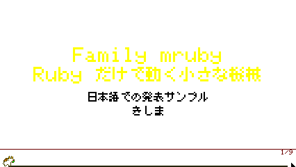 |
| 2/9 | 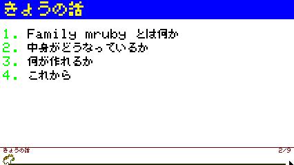 |
| 3/9 | 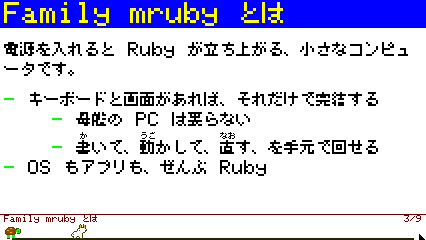 |
| 4/9 | 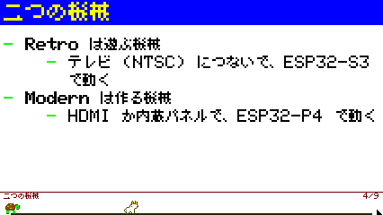 |
| 5/9 | 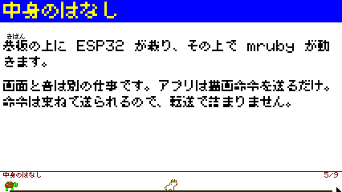 |
| 6/9 | 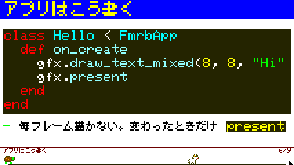 |
| 7/9 | 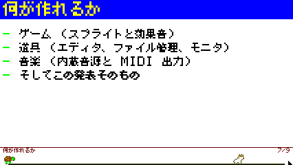 |
| 8/9 | 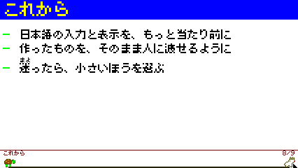 |
| 9/9 | 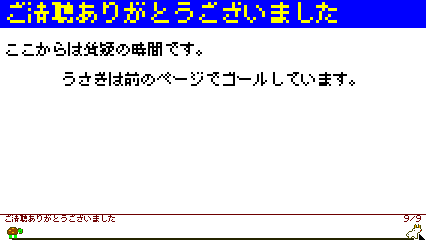 |

### デッキ側で直したもの (3 件)

1. **5 枚目「中身のはなし」が本文であふれ、wait の後の太字行が出なかった**
   (`render_content_slide` は `y + @line_h > max_y` で打ち切る)。段落を 2 行
   縮め、締めの一行も短くした。
2. **4 枚目の引用が折り返して「。」だけが 2 行目に残っていた**。末尾の
   「。」を落として 1 行に収めた。
3. **6 枚目のコードブロック中の日本語が豆腐 (□) になっていた**。コードは
   `draw_text` (Font0 = ASCII) で描かれるため。文字列を ASCII にし、
   ついでにコードを 1 行減らして下の箇条書きが入るようにした。

## 検収: Linux sim (headless, 426x240, FMRB_HW_TARGET=TAB5)

| 項目 | 結果 |
|---|---|
| メニュー | 起動直後に `home/demo.md` / `home/demo_ja.md` / `home/intro_ja.md` の **3 件**。`3 decks` |
| 選択 + Start | Down 1 回 + Enter で `demo_ja.md` を読み込み (`Loaded /home/slides/demo_ja.md: 6 slides`)、タイトルスライドが出る。**`intro_ja.md` は Down 2 回**(一覧の 3 行目) |
| Esc でメニュー | 戻る。スプライトも消える |
| タイマー仕切り直し | 3/11 で `04:26` → Esc → Start → 1/11 で **`04:57`** (allotted 5 分。ここまでの 3 秒ぶんだけ減っている) |
| Export | `demo.md` (11 枚) を書き出し、`flash/mnt/sd/picorabbit/demo/` に **01.bmp .. 11.bmp がちょうど 11 個**、各 307254 バイト (= 54 + 426*3 を 4 バイト整列した 1280 * 240) |
| 書き出しの絵 | `03.bmp` を PNG にして、同じスライド (wait 全開) の画面と pngdiff: 矩形 **(0,0,426,224) で 0 differing pixels** |
| 差分の場所 | 全画面では 208 px、**すべて y>=224** = 走者 2 匹のいる帯と、そこへ寄せたカーソル (書き出しでは走者を隠し、カーソルは入れない) |
| 日本語デッキの書き出し | `intro_ja.md` を書き出して `intro_ja/01.bmp .. 09.bmp` が **9 個**。2 枚目に番号、8 枚目のルビ行のマーカーが本文と同じ行にある |
| カーソル | 書き出しを 2 回まわしたあとにカーソルを動かして戻し、画面全体で **0 differing pixels** (カーソル下の背景の保存が壊れていない) |
| ログ | 書き出し中・後とも core / graphics-audio ともに **E / Exception 0** |
| 回帰 | 書き出し後に Start → Right/Right/Space でページ送り、Shift+t で時計、`i` で索引、Ctrl+Tab の退避と復帰、すべて P3 どおり |
| 放置中 | 発表中 **1.0 presents/s** |

書き出しの所要は sim で 11 枚 約 2.1 秒 (1 枚 200ms の固定待ちが支配。
graphics-audio 側の BMP 書き込み自体は数 ms)。

### 途中で踏んだもの

- **`LGFX_Sprite::readPixel` は 8bpp スプライトでも RGB565 を返す**。これで
  BMP を書いたら濃紺の見出し帯が水色 (`#0000ff` → `#00ffff`) になり、pngdiff
  が 31569 px 差になった。`readRect(..., (lgfx::rgb332_t *)buf)` で RGB332 の
  ままもらうように直して 0 差分になった。RGB332 → RGB888 の展開は
  `tools/fmrb_screenshot.py` と同じ `*255/7` / `*255/3` に揃えてある。
- graphics-audio だけ再起動すると **core が `INIT_DISPLAY ACK timeout` で
  起動に失敗する**。sim は 3 コンテナまとめて down/up する (CLAUDE.md どおり)。
- **書き出した絵を `flash/` に置いたままにすると esp32 のビルドが落ちる**。
  sim の書き出し先 `flash/mnt/sd/...` は storage 画像に取り込まれる場所なので、
  20 枚 (約 6MB) 残したまま `rake build:esp32` すると littlefs の作成が
  `LFS_ERR_NOSPC` で失敗する。検証後に消す。

## ビルドとテスト

| 対象 | 結果 |
|---|---|
| fmruby-core `rake build:linux` (FMRB_HW_TARGET=TAB5) | OK (`file` で x86-64 を確認) |
| fmruby-core `FMRB_HW_TARGET=TAB5 rake build:esp32` | OK (RISC-V。**display_p4 の JPEG 経路がここで初めてコンパイルされる**)。直したあとにもう一度通した |
| fmruby-graphics-audio `rake build:linux` | OK (x86-64) |
| fmruby-graphics-audio `rake build:esp32` | OK (Xtensa。**WROVER の `NOT_SUPPORTED` 分岐**がここで通る)。直したあとにもう一度通した |
| fmruby-core `rake test` | OK (BASIC golden 103 passed / 0 failed、picoruby-ti、MicroPython smoke)。直したあとにもう一度回して同じ |

触ったファイルに新しい警告は出ていない。作業後の build/ は core が esp32p4、
graphics-audio が esp32 (実機を焼ける状態) で置いてある。`.env` は 3 つとも
作業前と同一 (diff で確認)。

## 検収: 実機 (Tab5 / ESP32-P4)

`FMRB_HW_TARGET=TAB5 rake build:esp32` -> `rake flash` (USB-Serial-JTAG、ボタン
操作なし)。ブートログは `Guru|abort` が **0**、`Remote desktop ready:
http://192.168.10.21/` まで到達。以降は WiFi 経由 (`fmrb_rd_launch` /
`fmrb_rd_input` / `fmrb_rd_snap`) で操作した。シリアルはセッションの初めに 1 回
開いて開いたままにし、書き出しのログをそこで読んだ。

| 項目 | 実機での結果 |
|---|---|
| メニュー | 3 件 (`home/demo.md` / `home/demo_ja.md` / `home/intro_ja.md`)。SD があるので Export は有効 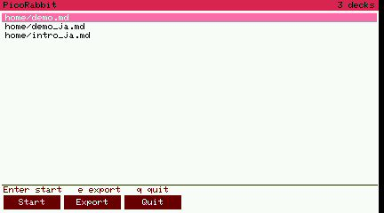 |
| `intro_ja.md` の表示 | End + Enter で開き、9 枚とも実機で確認 (下表) |
| 番号付きリスト | 2 枚目に `1.` から `4.` が本文と同じ大きさで出る |
| ルビ行のマーカー | 8 枚目の 3 項目目の `-` が本文と同じ行にある |
| Export (JPEG) | 9 枚を **2.8 秒**で SD へ。`01.jpg` 15796 B .. `09.jpg` 21426 B (display_p4 のログに 1 枚ずつ出る) |
| SD の中身 | shell で `ls /mnt/sd/picorabbit/intro_ja` -> `01.jpg .. 09.jpg` の **9 個** 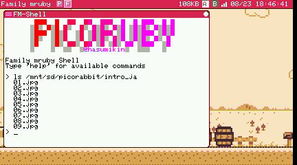 |
| 書き出し中の配信 | 書き出しと同時に 3 回スナップして 3 回とも成功 (0.25 / 0.91 / 0.17 秒)。remote desktop は止まらない |
| 書き出し後の配信 | スナップも `/status` も通常どおり |
| 取り直しの書き出し | `demo.md` を 2 回書き出して 11 枚が上書きされる。**1 枚ずつ 0.2-0.5 秒間隔**で進む = 既存ファイルで待ちが素通りしていない |
| ログ | 一連の操作で `E (` は 3 行。いずれも既知で PicoRabbit とは無関係 (BT の MAC、HID の control transfer timeout) |
| 生存 | 操作のあとも `/app/list` で PicoRabbit が RUNNING |

### 実機での 9 枚

| # | 画像 |
|---|---|
| 1/9 | 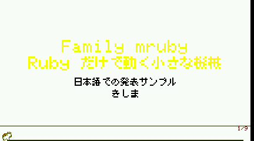 |
| 2/9 | 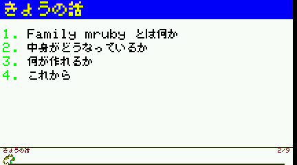 |
| 3/9 | 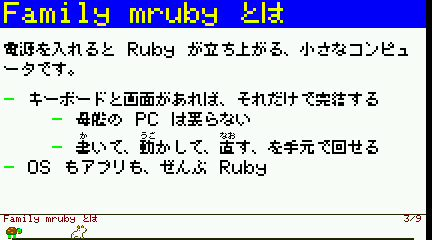 |
| 4/9 | 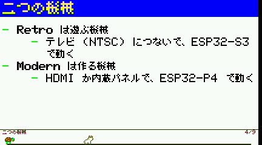 |
| 5/9 | 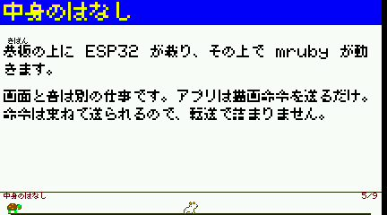 |
| 6/9 | 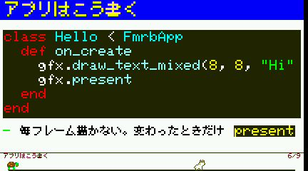 |
| 7/9 | 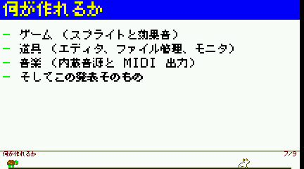 |
| 8/9 | 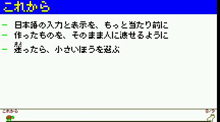 |
| 9/9 | 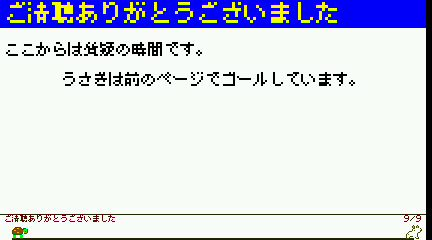 |

書き出し直後のメニュー (状態行に結果が出る): 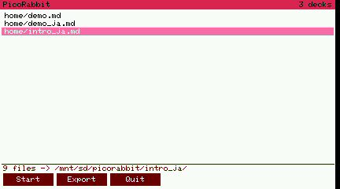

**ユーザ確認待ち**: 書き出した JPEG の中身 (SD を抜いて PC で開く)。実機の
見た目そのもの (色や字の詰まり) も最終的にはユーザ確認。

## renderer の直し 2 件

report の初版では「指示書の関所どおり止めて指示待ち」としていた 2 件。引き継ぎの
うえで直した。どちらも `intro_ja.md` で見えていたもの。

1. **番号付きリストに番号が出ない**。parser が `1. ` を落として本文だけを
   `Element(:numbered)` に入れ、renderer は 2 文字ぶん字下げするだけだった。
   Element に `number` を持たせ、parser が書かれていた数字をそのまま入れ、
   renderer が `1. ` を箇条書きのマーカーと同じ描き方で描く
   ()。位置ではなく**書かれた番号**を出すので、
   `1. 1. 1.` と書いた一覧はそのとおりに出る。
2. **ルビを含む箇条書きで `-` が 1 行上にずれる**。マーカーを `y` に描いてから
   本文を描いていたが、ルビのある行は本文が `RUBY_H` (8px) 下がるため。
   本文の行組みを**先に**行い (`layout_rich_text`)、その 1 行目がルビを持つかを
   見てからマーカーを描くようにした ()。

作りとしては、`draw_rich_text` を「行組み」と「描画」(`draw_rich_lines`) に割り、
箇条書きと番号付きの両方が `draw_list_item` を通る形にした。行組みは 1 回だけで、
マーカーの位置は行組みの結果から決まる。

**踏んだもの**: 行組みは幅を測るために文字サイズを 1 に落とす (`w1`)。
マーカーの `set_ts(@ts)` を行組みの**前**に置くと、番号だけ一回り小さく描かれる
(最初これで出た)。サイズは行組みのあとに設定する。

## 指示書との差分

- 書き出しの完了待ちを**1 枚ごと**にした (指示は最後の 1 枚のみ)。上限 10 秒は
  同じ。
- 進捗表示は**書いたスライドの上**に出る (指示は「メニュー上」)。理由は T3 に
  書いたとおり。
- ファイル名の拡張子をプラットフォームに合わせた (`.jpg` / `.bmp`)。
- メニューに `e` (Export) と Esc (終了) のキーを足した。
- 書き出した絵にトラック線は残る (指示は「うさぎ・亀を隠す」だけなので
  そのとおりにした)。走者だけが消える。
- `intro_ja.md` は 9 枚 (指示書の記述は 8 枚)。
- 指示書が「report に書いて止める」とした renderer の 2 件は、引き継いだうえで
  直した (上記「renderer の直し 2 件」)。
- sim の書き出しはカーソルを入れない (指示書はカーソルに触れていないが、実機側の
  作りに揃えた)。

## やらないこと (指示どおり)

1280x720 での書き出し、スライドの表、JPEG/BMP 以外の形式、発表中のメニュー
呼び出し、Spinel 側の `export_frame`。
