# P6 report: 本文を efont で描く

対象: `lib/add/picoruby-fmrb-app/mrblib/fmrb-gfx.rb`、
`lib/add/picoruby-fmrb-picorabbit/mrblib/picorabbit_renderer.rb`、
GFX の SET_FONT (core と graphics-audio の両方)、`FmrbConst::HW_FAMILY`。
指示書は `doc/picorabbit/instruction_p6.md`。画像は `report/p6/`。

## 決めたこと (実測で決まった 1 件を含む)

| 用途 | Modern | Retro |
|---|---|---|
| 本文 | efont 12 | efont 12 |
| 見出し | efont 16 | **efont 16 (入れた)** |
| 太字 | efont 12 bold | **efont 12 bold (入れた)** |
| ルビ | misaki 8 | misaki 8 |
| コード | efont 12 | efont 12 |

Retro に 16 と太字を入れるかは指示書どおり**実測で決めた**。WROVER の
app 区画 (2000K) は、

| | bin | 区画の残り |
|---|---|---|
| 入れない | 834,144 B | 1,212,320 B (59%) |
| 入れる | 1,610,304 B | **437,184 B (21%)** |

増分は **776,160 B**。判断の分かれ目 (残り 200KB) を上回るので入れた。ただし
**bin はほぼ倍**になり、焼き時間もそのぶん増える。切り戻しは
`graphics_handler.cpp` の `FMRB_FONT_JA_EXTRA` を 0 にし、Ruby 側の
`FmrbGfx::FONT_AVAILABLE` の `"retro"` 行から 2 つ落とすだけ。

Tab5 (core) 側も同じ 2 つが入る:

| | bin | 区画 (6M) の残り | 書き込み (460800bps) |
|---|---|---|---|
| P6 前 | 4,976,464 B | 1,314,992 B (21%) | 18.0 秒 |
| P6 後 | 5,760,768 B | **531,712 B (8%)** | 20.6 秒 |

**Tab5 の残りが 8% まで落ちた**。今回の範囲では問題ないが、次に大きいものを
足すときは区画の見直しが要る (`rake flash` 全体では 58.7 秒)。

## T1: フォントの持ち物を機種で分ける

- `fmrb_link_protocol.h` (**両リポジトリに同じ値**) に
  `FMRB_LINK_GFX_FONT_FAMILY_JA_BOLD = 2` を追加。size は px のまま
  (JA は 8 / 12 / 16、bold は 12)。
- display 側 (Tab5 の `display_p4_task.cpp`、WROVER と sim の
  `graphics_handler.cpp`) は 16 と bold を引けるようにし、**持っていない
  組み合わせは近いものに落として警告を 1 行**出す (12 へ、または通常の字形へ)。
- `FmrbGfx`:
  - `FONT_METRICS` に `[:ja, 16]` (char_w 16 / half_w 8 / kana_w 16 /
    line_h 16) と `[:ja_bold, 12]` (12 と同じ) を追加。
  - **機種の持ち物表 `FONT_AVAILABLE`** を新設。`set_font` は頼まれた組が
    無ければ近いものに置き換え、**実際に選んだ `[family, size]` を返す**。
    `@current_font` も置き換え後になるので `text_width` / `font_height` は
    描かれるものの寸法を返す。
  - 呼ぶ側は戻り値で「太字が無かった」ことを知り、自分で太く描ける。
- `FmrbConst::HW_FAMILY` (`"modern"` / `"retro"`) を新設。esp32 は
  `IDF_TARGET`、Linux は rake が `-DFMRB_HW_FAMILY` で渡す
  (`fmrb_hw_defines.cmake` の linux 分岐 → `FMRB_HW_FAMILY_MODERN`)。
  **sim は実機と同じ持ち物表に従う**ので、Retro 向け sim は Retro の見た目に
  なる。P4 専用コードを巻き込まないよう `FMRB_HW_MODERN` とは別のマクロに
  してある。
- `sig/fmrb_gfx.rbs` の `set_font` を更新 (family 追加と戻り値)。

## T2: renderer

- frontmatter に `font:` (`efont` | `misaki`、既定 efont) と `font_size:`
  (12 か 16、既定 12) を追加。efont のときは `text_size` を無視して
  ログを 1 行出す。`font: misaki` は P2 までの経路 (Font0 + misaki を
  整数倍) をそのまま通す。
- 描画は**役割で選ぶ**形にした: 本文 / 見出し / ルビ / 太字 / UI
  (`use_body` / `use_head` / `use_ruby` / `use_bold` / `use_ui`)。
  `draw_str` が efont なら `draw_text`、misaki なら `draw_text_mixed` を
  呼び分ける。寸法は `wb` / `wh` / `wr` がフォントから測る。
- 行の高さはフォントから (`px + px/4`。8px で 10 だった比を引き継いだ)。
  字下げやコードの桁は**半角セル `@ascii_w`** で測る (efont は px/2)。
- ルビは efont のときも misaki 8 のまま (efont の最小は 10 で大きすぎる)。
- **スライドを描き終えたら UI の字 (Font0) に戻す**。アプリ側のメニューや
  書き出しの進捗は自前で `draw_text` を呼ぶので、デッキの字のままだと
  そちらが崩れる。`fmrb` ブロックも 6px 桁前提なので UI の字を渡す。
- サンプル 3 本から `text_size: 2` を外した (既定の efont 12 で出る)。

## 検収: Modern 向け sim (FMRB_HW_TARGET=TAB5、426x240)

`intro_ja.md` 全 9 枚:

| # | 画像 | # | 画像 |
|---|---|---|---|
| 1 | 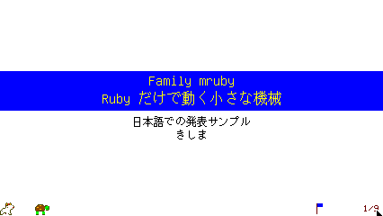 | 6 | 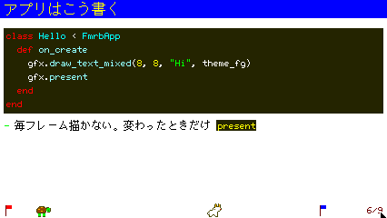 |
| 2 | 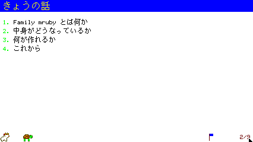 | 7 | 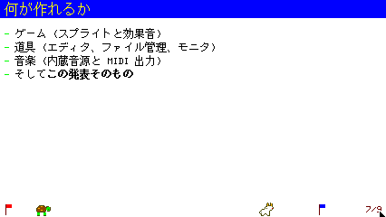 |
| 3 | 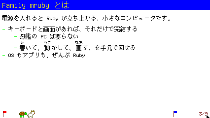 | 8 | 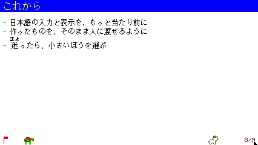 |
| 4 | 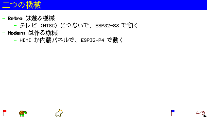 | 9 | 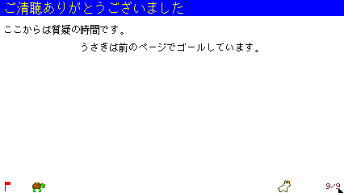 |
| 5 | 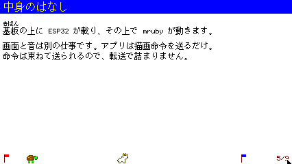 | | |

見出し 16px と本文 12px を 4 倍に拡大したもの:
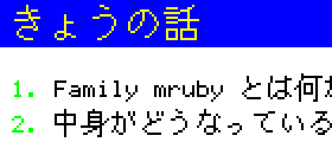

| 項目 | 結果 |
|---|---|
| 太字 | **efont の太字**。判定は画素で行った: 太字の行が「本文を 1px ずらして重ねた絵」と **491 画素違う** (重ね描きならちょうど 0)。インクの量も 481 → 690  |
| 折り返し | 右端の列 (x=423) が地の色 1 本だけ = 本文がはみ出していない (3 / 5 / 8 枚目で確認) |
| ルビ | base の上に 8px (P2 と同じ) |
| `font: misaki` の回帰 | `text_size: 2` を付けた一時デッキが **P6 前の絵と本文域で 0 差分** (2-9 枚目すべて、矩形 (0,24,426,180)) |
| 放置中 | **1.0 presents/s** |
| ログ | core / graphics-audio とも E・Exception **0** |

## 検収: Retro 向け sim (FMRB_HW_TARGET=NARYAv3、320x240)

同じ `intro_ja.md` が落ちずに開く。**16 と太字を入れたので Modern と同じ
見た目**になる (入れない判断だったときは見出しが 12px に落ちる。切り替えの
実験もして、そのときの絵も確認済み)。

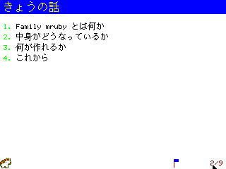

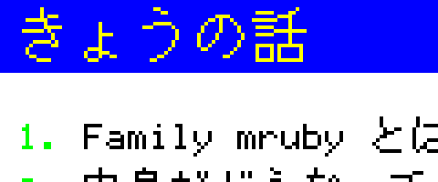

入れない設定 (`FMRB_FONT_JA_EXTRA` 0 相当) で同じ画面を出したときの見出し。
16 が無いので本文と同じ 12px に落ちる:

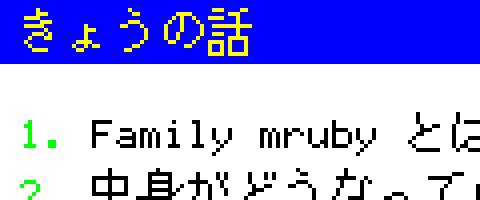

太字は Modern と同じ画素 (本文 481 / 太字 690、ずらし重ねとの差 491)。
E・Exception 0。

## 検収: 実機 (Tab5 / ESP32-P4)

`FMRB_HW_TARGET=TAB5 rake build:esp32` -> `rake flash` (58.7 秒)。ブートログは
`Guru|abort` **0**、`Remote desktop ready` まで到達。`E (` は 3 行で、いずれも
既知で無関係 (BT の MAC、HID の control transfer timeout)。

| # | 画像 | # | 画像 |
|---|---|---|---|
| 1 | 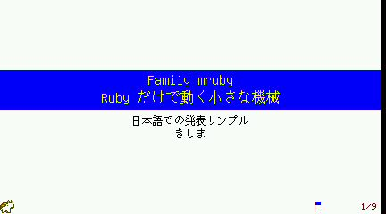 | 6 | 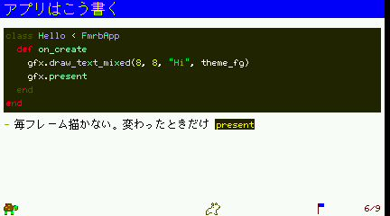 |
| 2 | 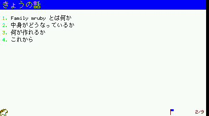 | 7 | 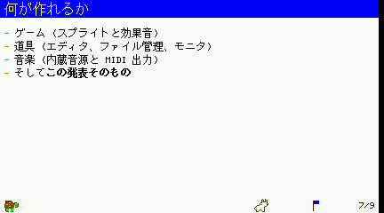 |
| 3 | 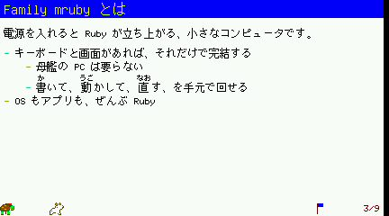 | 8 | 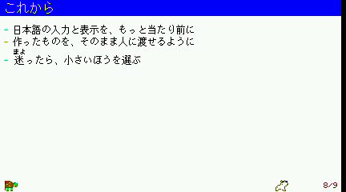 |
| 4 | 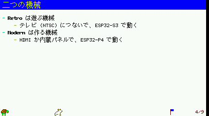 | 9 | 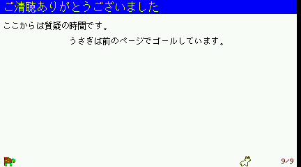 |
| 5 | 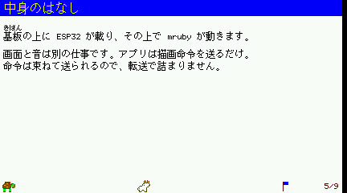 | | |

| 項目 | 結果 |
|---|---|
| 書き出し | 9 枚を **2.84 秒**で SD へ (`01.jpg` 14321 B ..) |
| 書き出した絵 | `fmrb_rd_fs.rb pull` で取得し、同じスライドの実機画面と pngdiff: 矩形 (0,0,426,224)、許容差 48 で **10 画素**違い。すべてルビの細い画の周りで、配信 (品質 80) と書き出し (品質 90) の符号化差 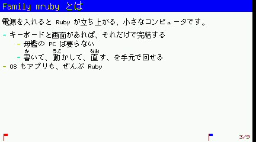 |
| コードブロック | 実機でも efont。**日本語がコードの中でも出せるようになった** (P4 までは Font0 で豆腐になり、デッキ側で ASCII に直していた) |

## ビルドとテスト

| 対象 | 結果 |
|---|---|
| fmruby-core `rake build:linux` (TAB5 / NARYAv3 の両方) | OK (x86-64 を確認) |
| fmruby-core `FMRB_HW_TARGET=TAB5 rake build:esp32` | OK (RISC-V) |
| fmruby-graphics-audio `rake build:linux` | OK |
| fmruby-graphics-audio `rake build:esp32` | OK (Xtensa。フォントあり / なしの両方を通して測った) |
| fmruby-core `rake test` | OK (BASIC golden 103 passed / 0 failed、fmrb_ui、picoruby-ti、MicroPython smoke) |

`.env` は作業前と同じ (`FMRB_HW_TARGET=TAB5`)。

## 途中で踏んだもの

- **`dev_run_check.sh --keep` は稼働中のスタックを再利用する**ので、ビルドし
  直しても古い実行ファイルのまま動き続ける (プロセスが古い inode を掴んだ
  まま)。Retro の確認で「表を直したのに反映されない」と 1 往復した。
  ビルド後は必ず `docker compose down` してから上げる。
- **行組みは幅を測るために文字サイズを 1 に落とす** (`w1` / `text_width`)。
  役割を選ぶ (`use_body`) のは行組みの**後**でないと、マーカーだけ別の字で
  描かれる。
- graphics-audio を esp32 で建てたあと linux に戻すには `rake clean_all`
  (`rake build:linux` だけだと sdkconfig の target 不一致で止まる)。

## 指示書との差分

- Retro にも 16 と太字を入れた (実測が判断の分かれ目を上回ったため。
  指示書は「入れない」場合の落とし方も書いてあり、そちらも実験して確認済み)。
- `font_size:` は 12 と 16 のみ受ける。16 のときは見出しも 16 のまま
  (24 は入れない決定なので、帯と位置で見出しを立てる)。

## 残り (ユーザ確認)

- **Retro 実機 (S3 + WROVER)**: WROVER を焼き直して `intro_ja.md` が開くこと。
  remote desktop が無いので写真はユーザ。**bin が倍になっているので焼き時間が
  伸びる**。
- 実機の見た目そのもの (色・字の詰まり) と、書き出した JPEG の中身。

## やらないこと (指示どおり)

Gothic / Mincho / 24px 以上、斜体、プロポーショナル、SD からの VLW 読み込み、
索引・メニュー・フッタのフォント変更。
