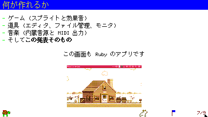
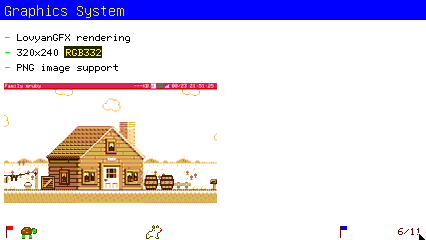
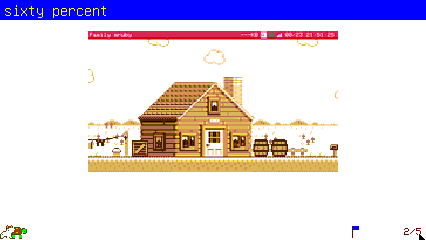
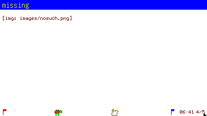
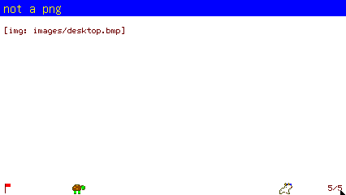
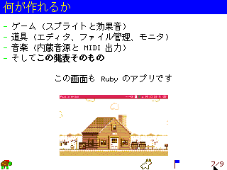
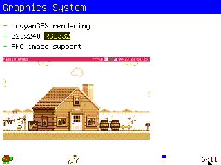
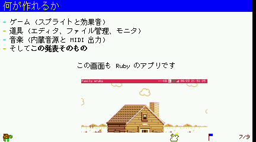
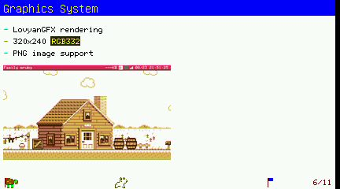
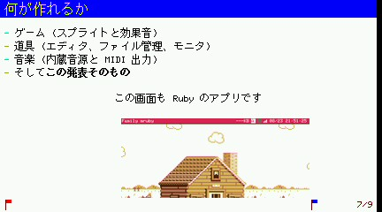

# P7 report: スライドに画像を載せる

対象: `lib/add/picoruby-fmrb-picorabbit/mrblib/` の parser / slide / renderer、
`flash/app/tool/picorabbit.app.rb`、サンプル (`flash/home/slides/images/` と
デッキ 2 本)。指示書は `doc/picorabbit/instruction_p7.md`。画像は `report/p7/`。

## 何が足りなかったか

parser は前から `` を `:image` の要素にしていて、renderer にも
`create_image` → `draw_image` の呼び出しはあった。**足りなかったのは
ファイルを描画側へ渡すこと**で、Retro と sim では描画側が別のストレージを
持つため、パスを渡しても見つからず `[img: ...]` に落ちていた (Tab5 だけは
core と display が同じ VFS なので**たまたま**出ていた)。

## 実装

- **描くたびに `sync_file` → `create_image` → `draw_image` → `delete_image`**。
  写す先は `/cache/app/picorabbit/<デッキ名>_<ファイル名>` (スプライトと同じ
  置き場)。sync_file は中身が一致すれば転送しないので、2 回目以降はただ同然。
- **相対パスは .md のあるディレクトリ基準**。renderer に `deck_path=` を足し、
  アプリがデッキを読むときに渡す。`/` で始まるパスはそのまま (SD など)。
- **alt が大きさの指定**を兼ねる: `` は px、`` は本文幅に
  対する割合。どちらでもない alt は捨てる (表示しない)。parser が読み取り、
  `Element#img_w` / `#img_pct` に入れる。
- **大きさの決め方**: 指定が無ければ自分の大きさ (本文幅より広ければ本文幅)。
  指定があればその幅。**どちらの場合も、残りの高さに入らなければそこまで
  縮める**。`draw_image` の `scale_x` に倍率を渡し、`scale_y` は 0.0 (等比)。
- 横位置は既存の `{:.center}` / `{:.right}`。画像の下に `@line_h / 2` の余白。
- **PNG のみ**。拡張子が違う / ファイルが無い / 復号に失敗した場合は
  `[img: パス]` を 1 行出して次へ進む (例外で落とさない)。renderer にあった
  `.bmp` → `.png` の書き換えは消した (BMP はスプライト用で、`create_image` は
  読まない)。
- 1 枚ごとに `sync` と `draw` の所要をログに出す (下の数字はこれ)。

## 検収: sim (Modern 向け 426x240)

| 項目 | 結果 |
|---|---|
| `intro_ja.md` | 本文幅の 60% を頼んだが**残り高さが効いて 152x86**、中央  |
| `demo.md` | 指定なしで**等倍 213x120**、左寄せ  |
| 60% の実測 | 高さに余裕のある一時デッキでは **250x140** = 本文幅 418 の 60% (250.8 → 250)。pngscan で左右端が **x=88..337**、左右の余白が 88px ずつ  |
| `w=200` | **200x112**、左端 x=4 から 200px |
| ファイルが無い | `[img: images/nosuch.png]` が出て**落ちない**  |
| PNG でない | `[img: images/desktop.bmp]`  |
| 2 回目の描画 | **転送しない** (`sync 817ms` → `sync 9ms`、描画は 10-11ms) |
| 放置中 | **1.0 presents/s** |
| ログ | 実在するデッキでは core / graphics-audio とも E・Exception **0**。上の「ファイルが無い」枚だけ、意図した失敗として 1 回につき E が 1 行ずつ出る |

## 検収: sim (Retro 向け 320x240)

| 項目 | 結果 |
|---|---|
| `intro_ja.md` | 152x86 で中央 (本文幅 312 の 60% = 187 より、残り高さが先に効く)  |
| `demo.md` | 等倍 213x120 が本文幅 312 に収まる  |
| 初回の転送 | 18,676 B で **817ms** (Modern 向け sim と同じ。sim の転送路は UART ではないので**実機の Retro の数字にはならない**) |
| ログ | E・Exception 0 |

## 検収: 実機 (Tab5 / ESP32-P4)

`FMRB_HW_TARGET=TAB5 rake build:esp32` (bin 5,762,944 B、app 区画の残り 8%) →
`rake flash` (59.5 秒、app 部分は 21.5 秒)。ブートは `Guru|abort` **0**、
`E (` は 3 行で既知の無関係なもの (BT の MAC、HID の control transfer timeout)。

| 項目 | 結果 |
|---|---|
| `intro_ja.md` | 152x86 で中央  |
| `demo.md` | 等倍 213x120、左寄せ  |
| 所要 | **初回 sync 118ms + draw 40ms**、2 枚目のデッキで sync 82ms + draw 41ms。core と display が同じ VFS なので転送は実質ローカル複写 |
| 書き出し | Export した `07.jpg` に**画像が入っている** (`fmrb_rd_fs.rb pull` で回収)  |

## 画像の目安 (plan.md にも 1 行)

- **426x240 以下、100KB 以下**。それ以上は Retro の転送と描画側のメモリで
  苦しい。
- **初回の転送はスライドの表示を待たせる** (sim で 18.7KB / 817ms、実機 Tab5 で
  118ms)。sim の転送路は実効 23KB/s ほどで、Retro 実機の UART (921600bps、
  実効 90KB/s 前後) より遅い。**100KB の PNG なら Retro 実機で 1 秒強**の
  見込み。2 回目からは転送が無いので待ちは消える。
- 同じデッキの中で**同じファイル名の画像を別ディレクトリから使わない** (写す
  先の名前が `<デッキ名>_<ファイル名>` なので衝突し、描くたびに転送し直す)。

## サンプル

- `flash/home/slides/images/desktop.png` (213x120、18,676 B。デスクトップの
  画面を縮めたもの)。
- `intro_ja.md` の「何が作れるか」に `` +
  `{:.center}`。本文の行にも `{:.center}` を足した (寄せの指定は直前の要素 1 つ
  にかかるため、画像を足すと本文の中央寄せが外れる)。
- `demo.md` の「Graphics System」に ``
  (相対パス・指定なしの例)。

## 指示書との差分

- 指示書は「`![60%]` の幅が `content_w * 0.6` に一致」を検収に挙げていたが、
  **`intro_ja.md` のその枚では残り高さが先に効く**ので一致しない (152 < 250)。
  仕様どおりの動作なので、高さに余裕のある一時デッキを作って 250px を実測し、
  両方を上に載せた。
- 幅を px で指定した場合は、元より大きくても指定に従う (本文幅と残り高さが
  上限)。「拡大はしない」は指定が無いときの規則として実装した。

## やらないこと (指示どおり)

JPEG / BMP の表示、復号結果の保持、文字の回り込み、画像だけの全面表示。
