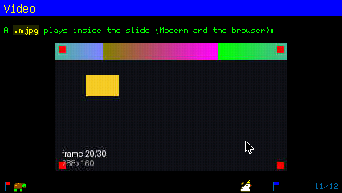
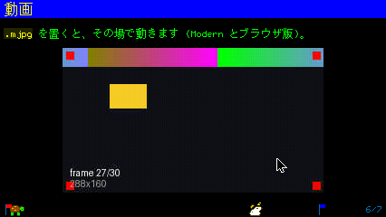
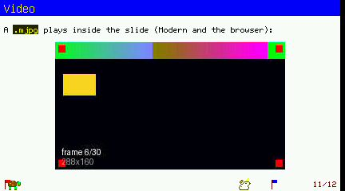
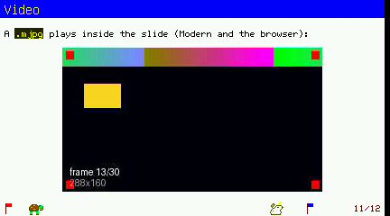
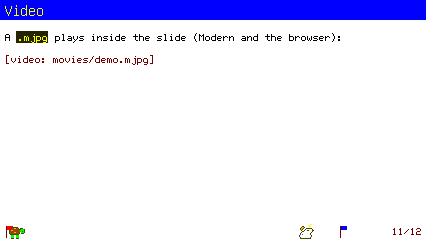

# P8 report: スライドに動画を載せる

対象: `lib/add/picoruby-fmrb-picorabbit/mrblib/` の parser / slide / renderer、
`flash/app/tool/picorabbit.app.rb`、サンプル (`flash/usr/share/samples/slides/`
の `movies/demo.mjpg` と demo.md / demo_ja.md)。指示書は instruction_p8.md。
画像は `report/p8/`。

## 何を足したか

- **parser**: `` の alt を空白区切りの語で読む
  (`apply_image_options`)。`w=NNN` / `NN%` (画像の大きさ、従来どおり) に
  `fps=NN` / `once` / `loop` (動画) が加わった。Element に `video_fps` /
  `video_loop`。
- **renderer**: `:image` の path が `.mjpg` なら `draw_video_element`。
  `video_open` で開いて大きさを知り、本文幅と残り高さに入るかを見て、寄せの
  分だけ開き直し (`calc_align_x_px`)、`render_slide` の present の後に
  `play`。`render_slide` / `render_index` の先頭で `stop_video`。
  `stop_video` は公開メソッド (アプリが呼ぶ)。
- **アプリ**: `draw_menu` / `show_overlay` / `on_suspend` / `on_destroy` で
  `@renderer.stop_video`。戻り側 (`clear_overlay` / `on_resume` /
  `close_index` / `jump_to_index`) は `draw_current` が開き直すので変更なし。
- **GFX 側の変更は無し**。再生器は doc/archive/video (P4) と
  doc/wasm/report/mjpeg.md (ブラウザ) のものをそのまま使う。

## 踏んだ罠

- **`stop_video` を `private` の後ろに置いた**。renderer は 555 行目に
  `private` があり、画像の描画関数はその下にある。動画の関数を画像の隣に
  並べたら `stop_video` も private になり、アプリからの
  `@renderer.stop_video` が NoMethodError で**Shift+b を押した瞬間に
  アプリが落ちた** (wasm で発見。動画の無い表紙でも落ちるので切り分けが
  早かった)。`destroy_sprites` の隣 (公開側) へ移した。
- **wasm の bundle は git 追跡分だけ**なので、未追跡の `demo.mjpg` は
  `web_fs put` で `/flash/usr/share/samples/slides/movies/` に置いて試した
  (MEMFS なので reload で消える。毎回 put)。demo.md の変更は追跡済み
  ファイルの作業木がそのまま入る。
- ブラウザ版では firmware のログが読めない。落ちたかどうかは shell の `ps`
  で見た。
- wasm ビルドは `source ~/emsdk/emsdk_env.sh` を先に通す (無いと
  `emcmake not found` で止まるが、rake の終了コードは 0 で返る)。
- **esp32 の build/ を退避して sim 用に `build:linux` → build/ を戻しても
  flash は通らない**。`sdkconfig` は repo 直下にあり、linux ビルドが
  `target 'linux'` に書き換えるので、`idf.py app-flash` が CMakeCache の
  esp32p4 と食い違って止まる。順番は Tab5 → sim にするか、sim のあとは
  `clean_all` から esp32 を作り直す (今回は後者、5 分の損)。

## 検収: wasm (ブラウザ、426x240)

| 項目 | 結果 |
|---|---|
| demo.md「Video」の枚 | 288x160 が中央に出て動く。frame 3 → 20 (2 回の撮影で帯と四角が移動)  |
| demo_ja.md「動画」の枚 | 同じく動く  |
| 索引 (i) → Esc | 索引の画面に動画のコマは乗らない。戻ると先頭から動き直す |
| 黒画面 (Shift+b) → 任意キー | 真っ黒のまま (コマが乗らない)。戻ると動き直す |
| Ctrl+Tab → Ctrl+Tab | 退避中はデスクトップだけ。復帰で動き直す |
| Esc (メニュー) | メニューにコマは乗らない |
| Shift+t (時計) | 動画と無関係に効く (Shift 経路の確認) |
| うさぎ・亀 | 動画の上に出ない位置 (足元の帯) で従来どおり歩く |

wasm の再生器は TJpgDec (software) だが、288x160 @15 では目で見て
コマ落ちは無い (mjpeg.md の 320x176 @15 drop 0 と整合)。

## 検収: Tab5 (ESP32-P4)

`rake clean_all && rake build:esp32` (bin 5,967,456 B、app 区画の残り 5%) →
flash (app_only) + サンプル 3 ファイルと**アプリ本体**を `tab5_fs put`。
ブートは `Guru|abort` **0**。

| 項目 | 結果 |
|---|---|
| demo.md「Video」の枚 | 288x160 が (69,53) に中央で出て動く。frame 6 → 13   |
| 所要 | **open 88〜99ms** (寄せの分の開き直しを含む)。再生器の profile: 1 コマあたり読み 1.4ms・復号 1.9ms・転記 8.3ms、**60 コマ中 59〜60 コマ転記** (最初の 60 コマで 1 コマ落ち、以後 0) |
| 黒画面 (Shift+b) | 真っ黒 (コマが乗らない) 。任意キーで動き直す |
| Ctrl+Tab → Ctrl+Tab | 退避中はデスクトップだけ、復帰で動き直す |
| 索引 / Esc (メニュー) | コマは乗らない。profile ログも止まる |
| wasm の門の回帰 | `gfx.c` の `!defined(FMRB_HW_MODERN) && !defined(FMRB_PLATFORM_WASM)` の後でも P4 で open / control / status とも通る (doc/wasm/report/mjpeg.md の未確認事項 4 はこれで済み) |

### 踏んだ罠 (Tab5)

- **app_only の flash は storage を更新しない**ので、`picorabbit.app.rb` が
  端末上では古いまま (黒画面で stop を呼ばない版) だった。索引 (renderer の
  内部から stop) では止まるのに黒画面では止まらない、という食い違いで気づいた。
  アプリ本体も `tab5_fs put` する。
- 動画を開いたままの PicoRabbit を `tab5_app kill` で止めると**強制 kill に
  なり内蔵 RAM が断片化** (`largest internal block 31744 < 32768`) して次の
  起動が `-2` で拒否される。ログの指示どおりリブート (シリアルを開き直す)。
  検証中に止めるときは `q` で正規に終える。

## 検収: sim (Modern 向け 426x240)

| 項目 | 結果 |
|---|---|
| demo.md「Video」の枚 | `[video: movies/demo.mjpg]` の 1 行に落ちて次へ進む  |
| 待ち | 無い。`video_open` は gfx.c の門で通信せずに nil を返す (Linux は `FMRB_HW_MODERN` でも `FMRB_PLATFORM_WASM` でもない) ので、10 秒の同期待ちにはならない |
| ログ | core / graphics-audio とも E・Exception 0 |

## 使い方の目安 (plan.md にも)

- 幅・高さは 16 の倍数。本文 1 行 + 動画なら **288x160** が Modern の 1 枚に
  収まる寸法 (title 20 + 4 + 15 + 160 + 8 = 207 < 220)。本文無しなら
  416x192 まで。
- 15 コマ/秒が既定。実物は
  `ffmpeg -i src.mp4 -vf "scale=288:160,fps=15" -q:v 4 -f mjpeg out.mjpg`。
- 1 枚に 1 本、音は無い、wait の段階送りで先頭からやり直す。

## やらないこと (指示どおり)

音声、拡縮、全画面の動画、1 枚に 2 本以上、途中からの再生。
