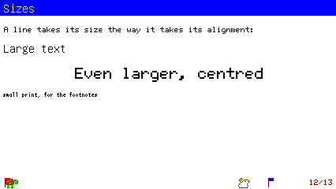
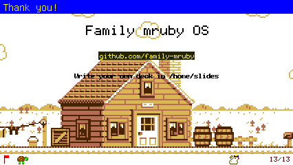
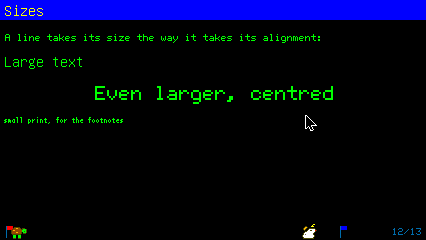
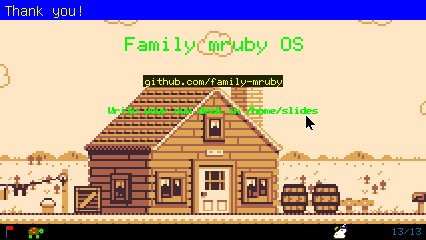
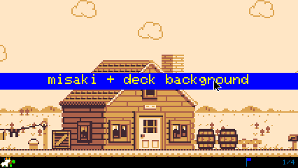
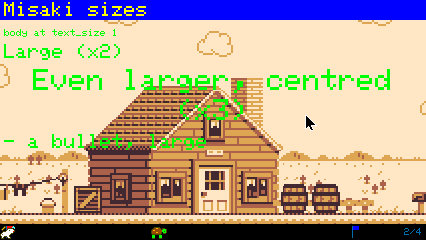
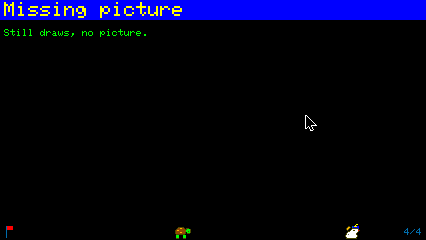
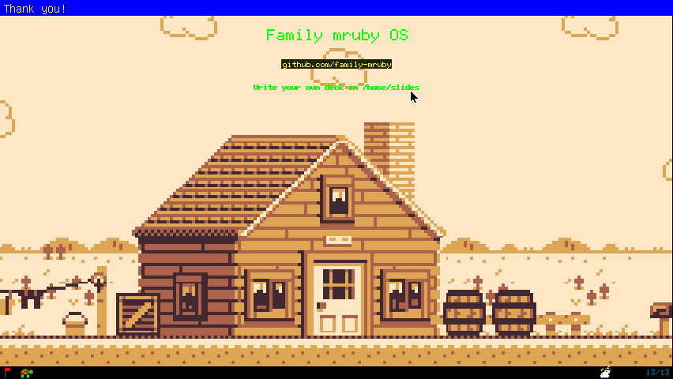
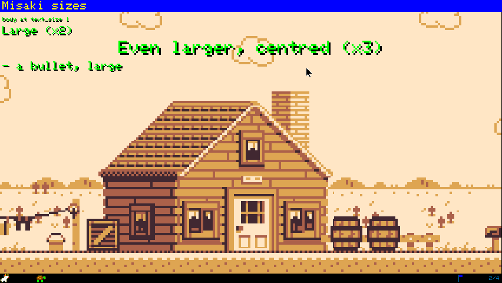

# P9 report: 背景画像と行ごとの文字サイズ

対象: `lib/add/picoruby-fmrb-picorabbit/mrblib/` の parser / slide / renderer、
`flash/app/tool/picorabbit.app.rb`、サンプル demo.md / demo_ja.md。指示書は
instruction_p9.md。画像は `report/p9/`。

## 何を足したか

- **parser**: `{:` 〜 `}` を class の並びとして読む `apply_classes`
  (`.center` `.right` `.small` `.large` `.xlarge`、併記可)。従来の
  `{:.center}` 単独もこの経路。`{::background path/}` は次の見出しまでの枚に
  付く (`Slide#background`、`none` で無地)。frontmatter `background:` は
  metadata のまま renderer へ。
- **renderer**: `use_size(size)` が現在の文字段 (`@cur_px` / `@cur_mul`) と
  `@line_h` / `@char_h` を決め、`use_body` / `wb` / `use_bold` がそれを読む。
  段は `SIZE_STEPS = [8, 12, 16, 24, 32]`、24 と 32 は 12 と 16 の
  `set_text_size(2)`。misaki 経路は倍率 `text_size` ±。要素ごとに
  `use_size(elem.size)` → 描画 → `use_size(nil)`。表紙の副題も同じ。
  背景は `draw_background` (`render_slide` の clear 直後) が
  `background_image` (path → [id, w, h] の表、3 枚まで) を `draw_image` で
  画面に引き伸ばす。背景のある枚は `draw_str` が `@theme.bg` の bg を nil に
  落として透明描画。索引は背景なし。
- **アプリ**: デッキ入れ替え時に `release_images`、読み込み時に
  `background=`。
- **影付き文字** (追加指示): `{:.shadow}` と frontmatter `shadow: true`。
  `draw_str` が `draw_run` を 2 回呼ぶ (影 → 本体)。影のある行は
  `@theme.bg` の箱を敷かない。テーマに `shadow` 色 (default / light 黒、
  dark 暗灰) を足した。太字の代替 (1px ずらし 2 度描き) は影も 2 度になるが
  見た目は変わらない。

## 踏んだ罠

- **`on_destroy` で `delete_image` は呼べない**。graphics context が先に
  無くなっていて "Graphics not initialized" の例外になる (`destroy_sprites` は
  通る)。終了時の画像は系が回収するので、`release_images` はデッキ入れ替え
  (`ensure_deck`) だけにした。
- **無いファイルを `create_image` に渡すと sim で 10 秒止まる**。graphics-audio
  が失敗を `-1` で返すと ACK が来ず、`send_sync` のタイムアウトまで待つ
  (Tab5 は同一 VFS なので即失敗)。`sync_file` の戻り値 (false = 写せなかった)
  を見て create を送らないようにした。P7 の画像も同じ経路だったので同じ直しを
  入れた。
- **Modern の表示側 (`display_p4_task.cpp` の DRAW_IMAGE) は scale を無視して
  等倍で貼っていた** (`pushSprite` だけ。graphics-audio は `drawPng(..., scale_x,
  scale_y)` で効く)。426x240 では倍率 1.0 なので気づかず、ユーザが 852x480 の
  ブラウザで「伸びていない」と見つけた。P7 の画像の拡縮も Modern では効いて
  いなかったことになる。`pushRotateZoom` (pivot を左上に置き、角度 0、縦横別の
  倍率) で直した。1:1 のときは従来の `pushSprite`。**GFX 側の変更が 1 か所
  入った**ので、Tab5 の firmware も作り直しが要る。
- 列挙の印 (`- ` / `1. `) の幅は `@ascii_w * 文字数` で数えていたが、大きさが
  行ごとに変わるので `wb(marker)` で測る形にした (本文と同じ大きさで描く)。

## 検収: sim (Modern 向け 426x240)

| 項目 | 結果 |
|---|---|
| demo.md「Sizes」 | large 16 / xlarge 24 中央 / small 8 (misaki) の 3 段  |
| demo.md「Thank you!」 | `bg_426x240.png` が画面全体、本文は透明で乗る。inline code とコード枠は塗りのまま、下の帯は不透明  |
| 背景の所要 | 初回 **189〜199ms** (sync 込み)、2 回目 **1ms** (表から draw_image を送るだけ) |
| 索引 (i) | 背景は出ない |
| `font: misaki` + frontmatter `background:` (一時デッキ) | 表紙に背景、x2 / x3 (折り返して中央) / 箇条書きの large が出る。`{::background none/}` で無地に戻る |
| 無い画像 `{::background images/nosuch.png/}` | 無地で描き続ける (直す前は 10 秒止まっていた。直した版は Tab5 で確認) |
| ログ | E は `on_destroy` の delete_image (直した) と無い画像の意図した失敗のみ |

## 検収: wasm (ブラウザ、426x240、テーマは cyberpunk)

Tab5 が USB から消えていたため (2026-09-04 00:23 にシリアルが途切れ、
/dev/ttyACM0 も無い)、実機の代わりにブラウザ版で確認した (ユーザ指示)。
`rake wasm:mruby` + `rake wasm:web` で作り直し、一時デッキは `web_fs put` で
`/flash/home/slides/` に置いた (IndexedDB なので reload で残る。検収後に消した)。

| 項目 | 結果 |
|---|---|
| demo.md「Sizes」 | sim と同じ 3 段  |
| demo.md「Thank you!」 | 背景が画面全体、本文は透明 。テーマの緑の字が絵の上では読みにくい (下の「使い方の目安」) |
| 一時デッキ 表紙 (misaki + frontmatter `background:`) | 表紙の帯の下に絵  |
| 一時デッキ「Misaki sizes」 | x2 / x3 折り返し中央 / 箇条書きの large  |
| `{::background none/}` → 無い画像 | 2 秒以内に「Missing picture」まで進む (10 秒待ちは無い)  |
| **852x480 のページ** (`?w=852&h=480`) で「Thank you!」 | 直す前は 426x240 の絵が左上に等倍で残りは黒。直した版は画面全体に伸びる 。文字は 12px のままなので、大きい画面では `font_size: 16` や `{:.xlarge}` を使う |
| 影付き `{:.center .xlarge .shadow}` (demo.md 最後の枚) | 24px の緑の字の右下 2px に黒の影。影の無い行はそのまま  |
| 影付き `shadow: true` (一時デッキ、misaki) | 全行に影 (x1 は 1px、x2 は 2px、x3 は 3px ずれ)。見出しの帯の字には付かない  |

Tab5 は未確認 (firmware はビルド済。同じ mruby コードなので手順は P8 と同じ:
flash app_only → アプリと .md を put)。

## 使い方の目安

- 背景は **426x240 の PNG** を用意すると等倍。別の大きさは引き伸ばされる
  (縦横比は保たない)。同梱の `/usr/share/backgrounds/bg_426x240.png` (4KB)
  が例。
- 文字の段は 8 / 12 / 16 / 24 / 32。24 と 32 は Modern で階段が見える
  (見出しやキャッチ用)。本文 12 のとき small = 8 は misaki なので漢字が粗い。
- 背景のある枚では本文の下に地色が敷かれないので、絵によっては読みにくい。
  `theme: dark` と組み合わせるか、暗めの絵を使う。

## やらないこと (指示どおり)

等比で余白を付ける置き方、JPEG 背景、行内の部分的な大きさ変更、見出しの
大きさ指定、背景の上の窓枠の透過。
