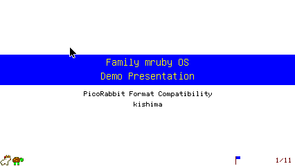
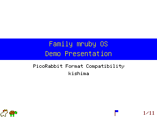
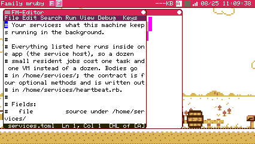

# A1 報告: ファイルの関連付けと「開く」の一般化

instruction_a1.md の T1-T4。検証は両機種向け sim (Modern 426 / Retro 320)。
エンジンは標準 (Spinel カーネル + Spinel エディタ) と全 mruby の 2 構成。
`.env` は書き換えていない。

**実機 (Tab5) の 1 本はまだ**。書き込み前に `fmrb_rd_ps` を叩いたところ
Monitor と SpriteEditor が動いており、ユーザが作業中と見て中断した (下記)。

## T1: 表と解決 API

- 二層。`config/associations.toml` → `/etc/associations.toml` (system_conf と
  同じ形で build.rake が cp。生成物なので `.gitignore`)、ユーザ上書きは
  `/home/associations.toml`。**拡張子ごとにユーザが勝つ**。
- 解決は gem に置いた: `lib/add/picoruby-fmrb-app/mrblib/fmrb-assoc.rb`。
  desktop・shell・ユーザアプリが同じものを使う (案 3 の公開 API)。
  Spinel の desktop に載せるため `tool/spinel/gen_app_combined.rb` の
  `system_desktop` の libs にも足した。

### 指示書から動かした 1 点: 戻り値は Array でなく String

指示書は `FmrbAssoc.resolve(path)` → `["run"] | ["edit"] | [アプリパス]` と
書いてあるが、**String 1 本**にした。3 つのうちどれか、という意味に読んだ
ためで、要素 1 個の Array を返す形にはしていない。

見分けは呼び手側で `FmrbAssoc::RUN` / `FmrbAssoc::EDIT` と比べるだけ。
**アプリのパスは必ず `/` で始まる**ので、この 2 定数と衝突しない。Spinel は
具体型を好むので、poly になりうる Array より String の方が安全でもある。

### toml の読解は流用せず、専用に書いた

services の `SvcConf.parse` は `[表]` と `[表.config]` を扱う一方、
関連付けの表は `拡張子 = 値` の行だけで、表も入れ子も無い。加えて
`SvcConf` は**サービスホストのアプリの中**にあり、gem からも desktop からも
届かない。20 行ほどの読み手を gem に書く方が、届かない物を共有するより
安い、と判断した (どちらにしたか report に、という指示への答え)。

### 大文字の拡張子

`README.MD` は `readme.md` と同じ種類のファイルなので、**拡張子だけを
downcase して**引く (表は小文字で書く)。ディレクトリ名に含まれる `.` は
拡張子と見なさない (`/home/my.decks/README` → 拡張子なし)。

## T2: file_manager と shell

- **ダブルクリック**が `FmrbAssoc.resolve` に従う。`run` は従来どおり自分を
  spawn、`edit` はエディタ、アプリパスはそのアプリに `open_path` で渡す。
  従来は `fmgr_runnable?` (拡張子 4 種の直書き) で「起動できる物だけ起動、
  他は無反応」だったので、**.md や .txt はダブルクリックしても何も起きな
  かった**。今は必ず何かが開く。
- **`fmgr_edit_file` の自前繰り延べを削除**した。spawn 後に
  `@fmgr_pending_edit_counter` を 3 tick 数えてから `FmrbApp.ps` でエディタを
  探して送る、という実装で、kernel の `open_path` (要求に添えるだけ、kernel が
  受け取れるまで待つ) と同じ仕事を、当て推量の待ち時間で行っていた。
  desktop 側の待ち受けコードごと消えている (Legacy は残さない)。
- 右クリックメニューの Run / Edit は**明示操作として据え置き**。表を引くのは
  「どちらとも言っていないとき」だけ。
- shell に **`open <path>`** を追加。`run` は従来どおり。

### 検収 (sim)

| 見るもの | Modern | Retro |
|---|---|---|
| `.md` → PicoRabbit がそのデッキで開く | 済 | 済 |
| `.rb` → 実行 (`run`) | 済 | 済 |
| `.toml` (表では edit) → エディタ | 済 | — |
| 表に無い拡張子 → エディタ | host テスト | host テスト |
| `/home` の上書きで `.md` をエディタに | — | 済 |

```
# ダブルクリック (Modern)
I system_desktop: File manager: open /home/slides/demo.md with /app/tool/picorabbit.app.rb
I spx:            Spawn open_path /home/slides/demo.md -> pid=5
I PicoRabbit+:    PicoRabbit: opening /home/slides/demo.md

# 上書き (/home/associations.toml に md = "edit" を置いた Retro)
I FM-Shell: Requesting spawn: default/editor
```







## T3: 受け側の実例

- **PicoRabbit**: `on_control` に `file_selected` を足し、`start_show(path)` で
  メニューを飛ばして直接開く。Esc でメニューへ戻るのは従来どおり。
- **nsf_player は `file_selected` を扱っていない** (`on_control` 自体が無い)。
  指示書の「扱わないアプリはただ起動するだけ。それで良い」に従い、触って
  いない。`.nsf` をダブルクリックすると NSF Player が自分の一覧を出して開く。
  受けるようにするなら、渡されたパスの basename を自分の一覧から選ぶ数行で
  済む (別途)。

## 見つかった既存の不具合: Spinel エディタが起動直後に落ちる

**`edit` は表の既定 (表に無い拡張子は全部これ) なのに、標準構成では
エディタが開かない。**

```
I spx: EditorApp created successfully
E spx: Exception caught: TypeError
E spx: Message: Object can't be coerced into Integer
I spx: Script ended
```

`EditorApp.new` の直後、`app.start` の中で落ちている。**起動経路によらない**
(デスクトップのメニュー / file manager / shell の `open` / `app =` のどれでも
同じ)。S1 の report に「builtin 名で spawn すると即終了する」と書いた既知の
件は、実はこれで、**spawn の仕方とは無関係**だった。

### 私の変更が原因ではないことの確認

エディタが使う Spinel 土台 (`fmrb_app_base_spinel.rb`) と FFI 宣言は S1/S2 で
私が触っているので、切り分けた。**この 2 ファイルだけを S1 前
(3be7d5f) に戻してビルドし直しても、同じ TypeError が同じ場所で出る**。
エディタ本体・mixin・`fmrb-ui.rb` は私の変更が入っていない (`git status` で
確認)。よって**既存の不具合**である。

- **全 mruby エディタ構成では正常**。`open /home/services.toml` でエディタが
  ファイルを開く (上の画像)。A1 の `edit` 経路自体は正しい。
- 直すのは A1 の範囲外なので手を付けていない。**別タスクとして切り出す**のが
  よい (バックトレースが空なので、まず出す所から)。

## 2 構成 / lint / テスト

| 項目 | 結果 |
|---|---|
| 標準 (Spinel カーネル + Spinel エディタ) | ビルド通過。`.md` / `.rb` は sim で確認。`edit` は上記の既存不具合で開かない |
| 全 mruby | ビルド通過。`edit` を含めて全部通る |
| Retro (`FMRB_HW_TARGET=NARYAv3`) | ビルド通過、320x240 で `.md` / `.rb` / 上書きを確認 |
| `rake spinel:doctor` | **新規指摘 0**。既存 3 件 (`clock_setting.rb` の RTC) のみ |
| `rake test` | 通過。**`assoc:test` を新設**して `rake test` に併合 |

### doctor で 1 件出して直した

最初 `::File.open` と書いたところ、desktop の生成で
`unsupported call: node ... (CallNode 'open') recv=ConstantPathNode` が出た。
**Spinel は定数パスを受信側にした呼び出しをコンパイルできない**。機械の他の
場所 (`nsf-header.rb`、`config_dialog.rb`) と同じく bare `File.open` に直して
解消。gem の module 関数でも bare で問題ない (mruby 側も従来どおり動く)。

host テスト (`test/assoc/run.rb`, 21 件) は**実物の gem ファイルを load** し、
2 つのファイル読みだけを差し替えている。見るもの: 特別値 (`run` / `edit`)、
アプリパス、既定、拡張子なし、ディレクトリ名の `.`、大文字混じり、
ユーザ上書き (置換と追加)、壊れた行、表が無いとき。

## まだ無いもの

- **実機 (Tab5) の `.md` ダブルクリック 1 本**。書き込み前の `fmrb_rd_ps` で
  Monitor と SpriteEditor が動いていたため、実機に触るのを止めた。
  ユーザの作業が一段落したら実施する。
