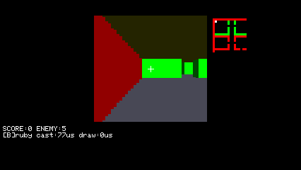
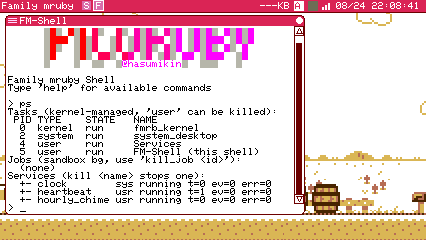
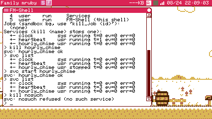
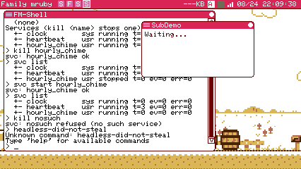
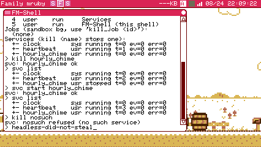
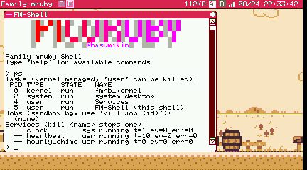

# S1 報告: ユーザサービスのホストと二層の一覧

instruction_s1.md の T1-T4 と、関門 1 のあとに追加指示のあった `wake_in` /
アイドル起床の緩和。**関門 2 の報告**。

検証は Linux sim (headless)。エンジンは標準 (Spinel カーネル + Spinel
エディタ、`.env` のまま) と全 mruby の 2 構成。`.env` は最初から最後まで
書き換えていない (シェルの環境変数で上書きした)。

読む順:「入れたもの」→「plan.md から動かしたところ」→「落とした穴」
→ 検収。**関門 1 のあとに見つかった一番大きな問題は
「アイドル 30 秒と wake_in の衝突」**で、`_spin` に離脱口を足して直した
(下記)。

## 入れたもの

| ファイル | 中身 |
|---|---|
| `main/prebuild_scripts/default_app/services.app.rb` | ホスト本体 (headless)。一覧の読み込み・生成・配送・tick・`svc/ctl`・`app =` の起動 |
| `main/prebuild_scripts/default_app/services/registry.rb` | 規則だけを切り出した部分 (toml の部分集合・二層の併合・エラー予算・次の眠り)。ファイルもメッセージも時計も触らない |
| `config/services.toml` → `/etc/services.toml` | システム一覧 (clock 1 本)。`rakelib/build.rake` が system_conf と同じ形で cp。生成物なので `.gitignore` |
| `flash/usr/share/services/clock.rb` | システムサービスの型見本。`clock/minute` と `clock/hour` を publish |
| `flash/home/services.toml` + `flash/home/services/` | ユーザ既定の一覧と 3 本 (heartbeat / hourly_chime / broken) |
| `components/fmrb_common/include/fmrb_task_config.h` | `FMRB_SERVICE_APP_PRIORITY (1)` と `FMRB_SERVICE_APP_TASK_STACK_SIZE (24KB)` を新設 |
| `main/app/fmrb_app_spawner.c` | builtin 表に `default/services` (headless・優先度 1) |
| `main/prebuild_scripts/kernel/fmrb_kernel.rb` ほか | ブート spawn、spawn 要求の `fullscreen` 上書き、headless に鍵盤を渡さない直し |
| `main/prebuild_scripts/default_app/shell/shell_commands.rb` + `shell.app.rb` | `ps` の子行、`kill <名前>`、`svc list` / `svc start` (T4) |
| `lib/add/picoruby-fmrb-app/` (mrblib + ports/esp32/app.c) と `main/prebuild_scripts/spinel/fmrb_app_base_spinel.rb` | `FmrbApp#request_early_update` (`_spin` の離脱口)。**両エンジンの土台に同じものを入れた** |
| `test/services/run.rb` + `rakelib/test.rake` | host テスト (`rake services:test`、`rake test` に併合) |

## 関門 1 のあとに足したもの (wake_in / アイドル起床 / shell)

### wake_in と on_wake

契約に `ctx.wake_in(ms)` と `on_wake(now_ms)` を足した。保留は 1 つだけで、
呼び直しは置き換え、**周期の予定はずらさない** (別枠の期限)。`on_wake` を
持たないサービスが `wake_in` を呼んだら警告 1 行を出して要求は捨てる
(そのサービスにつき 1 回だけ。毎 tick 呼ぶ書き間違いでログが埋まらない)。

`hourly_chime` を書き直した。**`interval_ms` を消し**、`on_event` で
`note_on` → `wake_in(200)` → `on_wake` で `note_off`。1 時間に 1 回の仕事の
ために 1 秒ごとに起きていたのが、起きなくなった。

### アイドル起床の緩和と、そこで見つかった穴 (重要)

`next_sleep` は上限を撤廃し (期限があればそこまで一息に眠る)、**期限が 1 つも
無ければ 30000** を返すようにした。

これを入れて `wake_in` を実際に使ったところ、**on_event から頼んだ起床が
最大 30 秒遅れた**。`svc list` の `wakes` が 0 のまま 12 秒経ち、次に見たら
1 になっている、という形で出た。

機序: `on_control` は **`_spin` の中**で呼ばれる。`_spin` は待ち時間の間ずっと
メッセージを配り続けるが、**自分からは早く帰らない**。だから配送は即時でも、
その配送が作った新しい期限は `on_update` に伝わらず、**いま走っている眠りが
明けるまで待たされる**。plan.md の「_spin は待ち時間中もメッセージを処理する
ので応答性は落ちない」は配送については正しいが、**配送が予定を作る場合には
足りない**。

直し方: 土台に **`FmrbApp#request_early_update`** を足した。呼ぶと今の `_spin`
がその場で終わり、`main_loop` が `on_update` に到達する。

- mruby 側: `_spin` (C) が入口で `@_spin_break` を false にし、メッセージを
  1 通配るごとに見て、立っていたら抜ける。**呼ばないアプリの負担はメッセージ
  1 通あたり ivar 読み 1 回**。
- Spinel 側: `fmrb_app_base_spinel.rb` の `_spin` (Ruby) に同じものを入れた。
  **両エンジンの土台を揃える**方針どおり。
- ホストは**期限が動いたときだけ**呼ぶ (`svc_wake_in` と `svc/ctl start`)。
  配送のたびに呼ぶと、賑やかな topic でホストが空回りするため。

実測 (アイドル 30 秒の状態で、購読だけのサービスに向けて publish):

```
I Services: svc[tmp_wake] event at 158607901: wake_in(200) from inside on_event
I Services: svc[tmp_wake] WAKE at 158608101 (+200 ms after the event)
```

### shell (T4)

`ps` は従来の一覧のあとに `Services (kill <name> stops one):` を出し、
`svc/ctl list` を投げる。**答えは待たずに、届いた順に `on_control` から
印字する** (`kill` が `kill_result` を受けて印字するのと同じ流儀)。
そのため子行は出力の最後に来る — 一覧の直後ではなく `Jobs` の下に置いたのは
このためで、上から読んで筋が通るようにした。

- **ホストが居ない機械では何も送らない** (タスク一覧に `Services` が無ければ
  そもそも要求しない)。サービスを使っていない人の `ps` が毎回タイムアウト
  報告で汚れないため。ホストが居るのに答えない場合だけ、約 0.3 秒
  (10 回の `on_update`) で諦めて `svc: services host not running` を出す。
- `kill <引数>` は**数字なら pid、それ以外はサービス名**。ホストごと止めたい
  ときは従来どおり pid。
- `svc list` / `svc start <名前>`。`start` はエラー 3 回で failed になったもの
  も数を 0 に戻して再開する。
- 子行は**ASCII だけ**にした (`  +- 名前 出どころ 状態 t= ev= err=`)。shell は
  桁を 6px 単位で数えるので、`└` のような文字は代替フォントで 8px で描かれ、
  以降の桁が 2px ずつずれる。

## plan.md から動かしたところ (3 件)

### 1. ctx に `audio` を足した (契約が 5 → 6)

plan.md のサンプル `hourly_chime` は「note_on 1 回」だが、**ctx の 5 つでは
音が出せない**。`FmrbAudio` はアプリの上に作るもので、サービスはアプリを
見ない設計だからである。ホストが 1 つ持ち、`ctx.audio` で貸す形にした
(初回に触ったときだけ作る)。

### 2. `svc/ctl list` の応答は 1 サービス 1 通に分けた

plan.md は `{"services"=>[...]}` を 1 通で返す形だが、**メッセージの本体は
176 バイト** (`FMRB_MAX_MSG_PAYLOAD_SIZE`) で、3 本で既に溢れる。しかも
溢れると `send_message` が raise する。最初の実装はこれでホストごと落ちた
(下記「落とした穴」)。

いまの形:

```
{"cmd"=>"svc",     "svc"=>{"name","origin","state","ticks","events","errors"}}   … 1 本ずつ
{"cmd"=>"svc_end", "count"=>n}                                                    … 終わり
{"cmd"=>"svc_result", "ok"=>bool, "name"=>..., "err"=>...}                        … stop / start
```

ps 側にとってもこの方が素直で、届いた順に 1 行ずつ印字して `svc_end` で
締められる (T4 でそう書く)。

### 3. kernel は 1 か所ではなく 3 か所になった

plan.md の「kernel の変更 (1 か所)」はブート spawn のこと。実際に必要だった
のは 3 か所で、残り 2 つは理由がある。

- **spawn 要求の `fullscreen`** (`handle_app_control` + `on_app_started`)。
  instruction の指示どおり「要求メッセージに載せられるか」を先に読んだ結果、
  **spawn 直後には載せられない**ことが分かった: `fmrb_app_set_fullscreen` は
  ctx が RUNNING でないと `FMRB_ERR_INVALID_STATE` を返し、spawn が戻った
  時点のタスクはまだ INIT である。実際に一度これで踏んだ (要求は成功した
  ように見えて、アプリは toml どおりの窓で上がる)。そこで pid を覚えておき、
  **アプリがキャンバスを持った `on_app_started` で実行時の切り替え
  (F11 と同じ `request_enter_fullscreen`) を掛ける**。plan.md が第二案として
  書いていた `fmrb_app_set_fullscreen` 経路そのもので、ただし呼ぶ時点が違う。
  pid は 1 枠でなく配列にした (`app =` が 2 つあれば 2 つ同時に起動しうる。
  同じ理由で 1 枠にして壊れた前例が起動表示にある)。
- **headless に鍵盤を渡さない** (`after_spawn`)。ホストは USER_APP なので
  spawn 通知が kernel に届き、`after_spawn` が **HID の宛先をホストに移して
  しまう**。ブート直後にデスクトップから鍵盤を奪う形になっていた。headless
  なアプリは窓もキャンバスも無いので、そもそも渡す先が無い。`background`
  の一般アプリにも同じことが起きていたはずで、これはその直しでもある。

## 決めたこと (instruction が「report に書け」と言っているもの)

- **toml の読み方**: Ruby 側に自前で書いた (`SvcConf.parse`)。文法は
  `[名前]` / `[名前.config]` / `key = value` の部分集合。理由は、C の
  `fmrb_toml` に Ruby の口が無く、10 行の一覧を読むためだけに C API を
  足す価値が無いこと。**読めない行は飛ばす** (手書きの一覧の打ち間違いが、
  正しく書けた他のサービスを巻き添えにしない)。
- **優先度の縛り方**: ホストは builtin 表の項目なので、優先度は表の
  `.priority = FMRB_SERVICE_APP_PRIORITY` 1 か所で決まる。`.app.toml` に
  `priority` を足していないので、**一般アプリが 2 より上を要求する経路は
  そもそも存在しない**。plan.md の縛りは構造で満たしている。
- **`start` で `on_start` は呼び直さない**。`on_start` は「起動時に 1 回」で、
  インスタンスは保持されているため。エラー数を 0 に戻して配送に戻すだけ。
- **`on_start` の例外はエラー 1 回**として数え、一覧からは外さない。3 回の
  予算がある意味 (起動直後の一過性にやられない) が `on_start` にも要るため。

## 落とした穴 (最初の実装が壊れていた点)

1. **応答が入らないとホストごと死ぬ**。`list` の 1 通が 237 バイトになり
   `send_message` が `ArgumentError` を投げ、それが `main_loop` を抜けて
   アプリが終了した。3 本のサービスが一緒に消えた。
   → 応答を分割 (上記) しただけでなく、**`on_control` と `on_update` の
   本体を rescue で囲った**。サービスの例外は `call_service` が押さえて
   いたが、**ホット自身の仕事 (応答・spawn 要求) の例外は誰も押さえて
   いなかった**。隔離が売りの機構が、要求 1 通で全滅しうる状態だった。
2. **spawn 直後の fullscreen は黙って効かない** (上記)。戻り値を捨てて
   いたので「成功したように見えるログ」だけが出ていた。

## 検収 (sim, headless)

`.env` のまま = 標準構成 (Spinel カーネル)。ログはすべて実物。

### 起動 / 両 toml 無し

```
I fmrb_default_apps: Spawning built-in app: default/services
I fmrb_app: [Services gen=1] Task spawned (id=4, prio=1)
I spx: Service host started (pid=4)
I app_canvas: [Services] Headless: no canvas allocated
I Services: services: clock started (sys, /usr/share/services/clock)
I Services: svc[heartbeat] hello
I Services: services: heartbeat started (usr, /home/services/heartbeat)
I Services: services: hourly_chime started (usr, /home/services/hourly_chime)
I Services: services: broken disabled
I Services: services: 3 running, 0 app(s) to start
I Services: svc[heartbeat] beat 1, up 9s      (以後 10 秒おき)
```

`prio=1` が新しい優先度。両方の toml を退避して起動すると、ホストの行は
**1 行も出ない** (`grep -c "Services|service host|default/services"` = 0)。


### 二層 (ユーザがシステムサービスを止める)

`/home/services.toml` に `[clock] enable = false` を足しただけで:

```
I Services: services: clock disabled
I Services: services: heartbeat started (usr, /home/services/heartbeat)
I Services: services: hourly_chime started (usr, /home/services/hourly_chime)
I Services: services: 2 running, 0 app(s) to start
```

出どころは `svc/ctl list` の応答に載る (`"origin" => "sys"` / `"usr"`)。

### oneshot

`oneshot = true` のサービスは `on_start` だけ呼ばれ、一覧から外れる
(`3 running` ではなく、外れた分を除いた数が出る。tick も配送も無い)。

```
I Services: svc[tmp_oneshot] oneshot ran once, config={"greeting" => "hi"}
I Services: services: tmp_oneshot started (usr, /home/services/tmp_oneshot)
I Services: services: tmp_oneshot oneshot done
I Services: services: 4 running, 0 app(s) to start
```

### アプリ起動 (`app =` + `fullscreen` 上書き)

`[tmp_game] app = "/app/game/raycaster.app.rb" / fullscreen = true /
delay_ms = 3000`:

```
I Services: services: starting app /app/game/raycaster.app.rb (fullscreen)
I spx:      Spawn request from pid=4: /app/game/raycaster.app.rb
I spx:      Spawn fullscreen: PID 5
I spx:      Runtime fullscreen: PID 5 -> 426x240
I fmrb_app: Window 'Raycaster' (PID 5) fullscreen at 426x240
I spx:      Entering fullscreen mode: PID 5 (depth 1)
(graphics-audio) Canvas 3 resized to 426x240 using setBuffer
```



ps では普通のアプリとして見える (pid 5、type user)。

**注意して読むところ**: 上書きは実行時の切り替え (F11 と同じ) なので、
アプリは一度自分の toml のサイズでキャンバスを作り、その直後に広げられる。
**resize で全面を描き直さないアプリは、古い絵を隅に残したまま**になる
(`/app/game/flappy.rb` で確認。`on_resize` はあるが背景を塗り直さない)。
アプリ側の話で、F11 でも同じことが起きる。毎フレーム描くアプリ
(raycaster) は上の画像のとおり問題ない。

### 配送

`clock/minute` は実物の時計から出ている (一時アプリで購読):

```
probe: <- clock/minute {"year" => 2026, "month" => 8, "day" => 24, "hour" => 20, "minute" => 13}
```

一時アプリから `clock/hour` を流すと、購読しているサービスに届く:

```
probe:   -> fake clock/hour
Services: svc[hourly_chime] chime for 7:00
```

`svc/ctl` の要求と応答 (一時アプリ。コミットしない):

```
probe: -> list
probe: <- svc/re/5 {"cmd"=>"svc", "svc"=>{"name"=>"clock",        "origin"=>"sys", "state"=>"running", "ticks"=>0, ...}}
probe: <- svc/re/5 {"cmd"=>"svc", "svc"=>{"name"=>"heartbeat",    "origin"=>"usr", "state"=>"running", "ticks"=>1, ...}}
probe: <- svc/re/5 {"cmd"=>"svc", "svc"=>{"name"=>"hourly_chime", "origin"=>"usr", "state"=>"running", ...}}
probe: <- svc/re/5 {"cmd"=>"svc_end", "count"=>3}
probe: -> stop hourly_chime
probe: <- svc/re/5 {"cmd"=>"svc_result", "ok"=>true,  "name"=>"hourly_chime"}
probe: -> stop hourly_chime          (2 回目)
probe: <- svc/re/5 {"cmd"=>"svc_result", "ok"=>false, "name"=>"hourly_chime", "err"=>"already stopped"}
probe: -> stop nosuch
probe: <- svc/re/5 {"cmd"=>"svc_result", "ok"=>false, "name"=>"nosuch", "err"=>"no such service"}
probe: -> start hourly_chime
probe: <- svc/re/5 {"cmd"=>"svc_result", "ok"=>true,  "name"=>"hourly_chime"}
```

停止中は `state` が `stopped` になり、`events` は届いた分だけ増える
(fake clock/hour の後に `"events"=>1`)。

### 隔離 (broken を有効にして)

```
E Services: svc[broken] RuntimeError: broken on purpose (tick 1)
I Services: svc[heartbeat] beat 1, up 3s
E Services: svc[broken] RuntimeError: broken on purpose (tick 2)
I Services: svc[heartbeat] beat 2, up 6s
E Services: svc[broken] RuntimeError: broken on purpose (tick 3)
E Services: svc[broken] disabled after 3 errors
I Services: svc[heartbeat] beat 3, up 9s      (以後も止まらない)
```

### 警告 (わざと 100ms 眠るサービス)

```
W Services: svc[tmp_slow] took 101 ms (over 50); count=1
W Services: svc[tmp_slow] took 101 ms (over 50); count=10
W Services: svc[tmp_slow] took 101 ms (over 50); count=20
```

1 回目のあとは 10 回ごと。ログを埋めない。

### ヒープ

一時サービス (5 秒周期で `GC.start` → `GC.stat[:live]`) を足して 80 秒放置:

```
20:11:49 live=2680
   ...      (16 点すべて同じ)
20:13:08 live=2680
```

heartbeat (10s)・hourly_chime (このときは 1 秒周期)・clock (60s) が回って
いる状態で **live は 1 も動かない**。

### 終了

```
I Services: App Services received stop command
I Services: svc[heartbeat] bye after 13 beats        <- on_stop
I Services: services: host stopped
I fmrb_app: [Services gen=1] Reaped
```

### 鍵盤を奪わないこと

ホストが上がったあとにメニューバーをクリックして開く。


### wake_in (追加分の検収)

一時サービスで、周期 1 秒の tick を回しながら 3 回目の tick で
`wake_in(2000)` → `wake_in(300)` と続けて頼む:

```
I Services: svc[tmp_wake] tick 2 at 157859830
I Services: svc[tmp_wake] tick 3 at 157860830
I Services: svc[tmp_wake] wake_in(2000) then wake_in(300): the second must replace the first
I Services: svc[tmp_wake] WAKE 1 at 157861139     <- tick3 + 309ms。300 の方が効いている
I Services: svc[tmp_wake] tick 4 at 157861830     <- tick3 + 1000。周期はずれていない
I Services: svc[tmp_wake] tick 5 at 157862830
```

- **1 回だけ届く**: 2000ms 側の起床は来ない (以後 WAKE 2 は無い)。
- **呼び直しで置き換わる**: 届いたのは 300ms の方。
- **周期がずれない**: tick 3→4→5 が 1000ms 刻みのまま。

`on_wake` を持たないサービスが毎 tick `wake_in` を呼んだ場合:

```
W Services: svc[tmp_nowake] called wake_in but defines no on_wake; ignored
```

1 行だけ (以後は黙る)。

### アイドル起床 (追加分の検収)

購読だけのサービス 1 本だけの一覧 = 期限ゼロ = 30 秒の眠り。その状態で
一時アプリから publish すると:

```
I SvcProbe: probe: -> fake clock/hour
I Services: svc[hourly_chime] chime for 7:00      <- 同じミリ秒。配送は落ちていない
```

そして `on_event` から頼んだ起床も遅れない (上の +200ms の実測)。

### T4: ps の子行



### T4: kill 名前 / svc list / svc start



`kill hourly_chime` → `svc: hourly_chime ok`、`svc list` で `stopped`、
`svc start hourly_chime` で `running` に戻る。無い名前は
`svc: nosuch refused (no such service)`。

ホストを `kill 4` で止めてから `svc list` を打つと、約 0.3 秒で
`svc: services host not running`。その状態の `ps` は**サービスの節を出さない**
(要求すら送らない)。

### T4 の回帰 2 行

`after_spawn` の headless 直しが一般のアプリに影響していないこと。

**窓ありアプリの起動でフォーカスが従来どおり移る**: shell を前面にして
`/app/demo/sub_demo.app.rb` を起動 → 新しい窓のタイトルバーが選択色になり、
続けて打った文字は **shell に入らない**。



**background アプリの起動で入力が奪われない**: 同じ手順で headless の一時
アプリを起動 → 打った文字は **shell の入力行にそのまま入る**。



## 2 構成 / lint / テスト

| 項目 | 結果 |
|---|---|
| 標準 (Spinel カーネル + Spinel エディタ) | ビルド通過、sim 起動・上記全検収 |
| 全 mruby (`FMRB_KERNEL_ENGINE=` `FMRB_APP_ENGINE_EDITOR=`) | ビルド通過、sim 起動、ホストとサービス 3 本、shell の `ps` 子行まで確認 (kernel のログタグが `spx` → `fmrb_kernel` に変わるので、確かに別エンジン) |
| `rake spinel:doctor` | **fmrb_kernel と editor は clean** (unsupported 0 / unresolved 0)。**`_spin` の離脱口を入れた Spinel 土台も clean**。指摘 3 件は `system_desktop` の `clock_setting.rb` (RX8130/RX8900 の `init` / `write_time`) で、**今回触っていない既存のもの** |
| `rake test` | 通過 (`fmrb_ui` / **`services`** / `picoruby-ti` / BASIC golden 103 / MicroPython) |

host テスト (`test/services/run.rb`, 87 件) が見るもの: toml の部分集合
(型・コメント・壊れた行の飛ばし方)、二層の併合 (フィールド単位・config も
キー単位・出どころ・元の Hash を壊さないこと)、エラー予算 (3 回・報告は
1 回・`start` で 0 に戻る)、`due?` と次の眠り (下限・上限なし・アイドルは
30 秒・停止中は期限を出さない)、`wake_in` (置き換え・1 回だけ・周期を
ずらさない・停止や failed で消える)。

## 実機 (Tab5 / ESP32-P4)

書き込み前に `fmrb_rd_ps` だけ単独で叩いて、動いているのが kernel と
desktop だけ (ユーザが何か触っている最中ではない) ことを確かめてから焼いた。

ブートは Guru / abort 0 件。ホストは他と同じ順で上がる:

```
I fmrb_app:   fmrb_app_spawn: name=Services, vm_type=0, mode=0, type=2
I fmrb_app:   [Services] internal RAM ok: free=251632 largest=208896 need=32768
I fmrb_app:   [Services gen=1] Task spawned (id=4, prio=1)
I fmrb_alloc: M1|spawn:Services|internal=226608|largest=184320|psram=24607992
I spx:        Service host started (pid=4)
I app_canvas: [Services] Headless: no canvas allocated
I Services:   services: clock started (sys, /usr/share/services/clock)
I Services:   svc[heartbeat] hello
I Services:   services: 3 running, 0 app(s) to start
I Services:   svc[heartbeat] beat 1, up 8s      (以後 10 秒おき)
```

### 費用 (実測)

| 見るもの | 値 |
|---|---|
| 内蔵 RAM (M1 の隣接差分 `spawn:system_desktop` 251632 → `spawn:Services` 226608) | **25,024 B (24.4 KB)** |
| タスクスタック (`fmrb_task:`) | 割当 **24,576 B** / high-water 残 **14,448 B** = **使用 10,128 B (41%)** |
| VM プール | 512,000 B (PSRAM。内蔵 RAM ではない) |

3 サンプル (clock / heartbeat / hourly_chime) を `require` してコンパイルした
あとの値で、**山はそのコンパイル**なので、これがこのサービス一覧での最悪値
である。内蔵 RAM の消費はほぼスタックそのもの。

`FMRB_SERVICE_APP_TASK_STACK_SIZE` は **24KB のままにした**。残り 14.4KB は
余りに見えるが、山を作るのは mruby の codegen の再帰で、これは**サービスの
本数ではなく 1 本の入れ子の深さ**で決まる (ユーザが深い Ruby を書けば伸びる)。
内蔵 RAM が逼迫したら 20KB までは下げられる、という数字として記録しておく。

### shell の ps 子行 (実機)



`kill <名前>` の経路も遠隔から確認した (存在しない名前を打って
`svc: hourly refused (no such service)`)。確認後、開いた shell は
`fmrb_rd_kill` で閉じ、実機は元の状態 (kernel + desktop + Services) に戻して
ある。

## 既知 (このやりで手を付けないもの)

- **builtin 名での spawn 要求**: `app = "default/editor"` のように builtin
  表の名前で spawn を頼むと、Spinel エディタ構成では**エディタが生成直後に
  そのまま終了する** (`EditorApp created successfully` の次の行が
  `Task exiting normally`)。`fullscreen` の上書きを外しても同じで、パス指定の
  アプリでは起きない。今回の変更とは無関係な既存の挙動。`app =` は
  パス指定で使う分には問題ない。
- **実行時 fullscreen と描き直し**: 上の「アプリ起動」節の注意書きのとおり。
  アプリ側の話で、F11 でも同じ。
