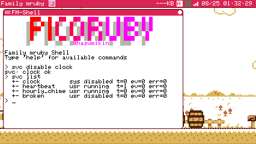
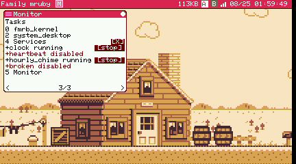

# S2 報告: Modern 限定化 / 自動再 spawn / enable・disable / Monitor

instruction_s2.md の T0-T3。**関門 2 の報告**。

検証は Linux sim (headless)。エンジンは標準 (Spinel カーネル + Spinel
エディタ) と全 mruby の 2 構成。`.env` は書き換えていない (シェルの環境変数で
上書きした)。

## T0: Modern 限定化

門は kernel の `spawn_service_host` の 1 行だけ:

```ruby
    return nil unless FmrbConst::HW_FAMILY == "modern"
```

Retro の firmware からは**実体を外した** (spawn しないだけでなく積まない):

| 何を | どこで |
|---|---|
| ホストの bytecode | `main/CMakeLists.txt` が `services.app.rb` を glob から除く |
| spawner の表の項目 | `main/app/fmrb_app_spawner.c` を `#ifdef FMRB_HW_FAMILY_MODERN` で囲う |
| サンプルと一覧 (storage) | 最上位 `CMakeLists.txt` が staging から `home/services*`・`usr/share/services`・`etc/services.toml` を落とす |
| `/etc/services.toml` の生成 | `rakelib/build.rake` が Modern のときだけ cp し、そうでなければ古いものを消す |

「Modern か」の判定は `fmrb_hw_defines.cmake` に
`fmrb_hw_family_is_modern()` を 1 つ置いて共用した (main と最上位が同じ答えを
見る)。

### plan.md から動かした 1 点: マクロは `FMRB_HW_MODERN` ではない

plan.md は `FMRB_HW_MODERN` と書いているが、**これは実機 P4 でしか定義されない**
(`fmrb_hw_defines.cmake`)。Linux sim ではどちらの機種を演じていても未定義なので、
これで囲うと「Retro sim で無効」と「Modern sim で T1-T3 を検収」が両立しない。
`FMRB_HW_FAMILY_MODERN` (実機 P4 + Modern を演じる sim) が正しい門で、これを
使った。

### 副産物: Spinel の生成 const に `HW_FAMILY` を足した

`FmrbConst::HW_FAMILY` は mruby (const.c) にはあるが **Spinel の生成 module に
無かった**。Spinel では未定義の `FmrbConst::X` はコンパイルを通り、**初回参照で
NameError を出して VM ごと落ちる** (制約文書 B の `KEY_F10` と同じ)。門が
Spinel カーネルの中にある以上これが要るので、`tool/spinel/gen_const_rb.rb` が
`FMRB_HW_TARGET` から `modern` / `retro` を出すようにした。生成器には
「使っているのに生成されていない定数があれば abort」の検査があるので、
これを入れ忘れていれば gen で止まっていた。

### 検収

| 項目 | 結果 |
|---|---|
| Modern sim (標準 / 全 mruby) | ホストとサービス 3 本が従来どおり |
| Retro sim (`FMRB_HW_TARGET=NARYAv3`) | ホストの行がログに **1 行も出ない**。`ps` にサービスの節が出ない。`svc list` → `svc: services host not running` |
| Retro の firmware | `services_irep` 未リンク、`services.c` 未コンパイル、storage の staging に services 一式なし |

`ps` / `svc list` は shell の「ホスト不在」の既存挙動がそのまま働いている
(S1 で入れたもの)。

### S3 のサイズ

門を外した同一ツリーのビルドと比べた実測 (どちらも `FMRB_HW_TARGET=NARYAv3`):

| | fmruby-core.bin |
|---|---|
| services を積んだ場合 | 3,992,000 B |
| **T0 後** | **3,973,344 B** |
| 差 | **-18,656 B** |

storage 側はさらに約 16.9KB 分のファイルが載らない。**S3 は S1 の前より増えて
いない** (残るのは kernel の門 1 行と `"default/services"` という 17 バイトの
文字列だけ)。

## T1: 自動再 spawn

### expected_stop: 意図した停止と異常死の区別

**案 A (指示どおり + アプリ側の穴埋め) で実装した**。「止めてくれ」と言われた
ところ全部で app context の 1 bit を立てる:

| どこ | 何を覆うか |
|---|---|
| kernel `handle_kill_request` | shell / monitor の kill。全 VM 種、協調・強制の両方 |
| `FmrbApp#stop` (mruby / Spinel の両土台) | 閉じるボタン、Ctrl+Q、スクリプトの完走 |
| C の drain (`fmrb_app_note_control_payload`) | "stop" を latch するだけの runtime (Lua / BASIC) |
| C `fmrb_app_kill` | 強制経路 (アプリが答えないまま消される場合) |

**なぜアプリ側の印が要るか**: mruby のアプリは例外で死んでも**スクリプト末尾の
rescue が拾うのでタスクは正常終了に見える**。C からは完走と区別が付かず、
kernel の kill だけを印にすると「閉じるボタンで閉じた」も異常死に見える。逆に
アプリ側だけでは強制 kill を覆えない。両方要る。

新 API は `fmrb_app_mark_expected_stop()` / `fmrb_app_was_expected_stop()` と、
その束縛 4 本 (mruby app / mruby kernel / Spinel app / Spinel kernel)。

### 落とした穴 2 つ

1. **終了通知は 2 系統あった**。`FmrbApp#destroy` が Ruby から
   `{"cmd"=>"exit"}` を送り、そのあと C のタスク後始末がもう 1 通送る。
   最初の実装は印を **context から読んで**いたので、`fmrb_app_kill` が
   先に slot を reap してしまう経路では**読む相手がもう居なかった**。
   → **印を終了通知そのものに載せた** (`{"cmd"=>"exit", "expected"=>bool}`)。
   context の生死に依存しなくなった。
2. **Ruby 側の通知に新しい鍵を足し忘れた**。1 の直後、`destroy` が送る方の
   通知だけ `expected` が無く nil → false と読まれ、**kill したアプリが
   生き返った**。`restart = true` のアプリを shell から kill して初めて出た
   (ホストの crash 経路は destroy を通らないので気付けない)。両土台の
   `destroy` に `"expected" => true` を足して解決 (destroy に到達する =
   main_loop が返った = stop が呼ばれた、なので常に真)。

**この 2 つ目が指示書の言う「ここを曖昧にすると kill の意味が壊れる」そのもの**
だった。検収表に「kill したら生き返らない」が入っていなければ通っていた。

### 誰が誰を

- **ホスト自身**: kernel が再 spawn する。ホストは**pid で見分ける**
  (`@service_host_pid`)。名前は slot の中にあり、終了時には既に消えている
  ことがあるため。
- **`app =` + `restart = true`**: ホストの仕事。kernel が
  **`app/died`** を publish し、ホストが購読して判断する。ホストは
  `restart = true` の項目が 1 つでもあるときだけ購読する。
- ホストが自分の起こしたアプリを見分けられるように、kernel は spawn 要求の
  答えとして **`{"cmd"=>"spawn_result", "app"=>パス, "pid"=>新 pid}`** を
  要求元へ返すようにした (`run_result` と同じ形)。launcher と shell は
  この cmd を見ないので無害。

### システム topic `app/died` (第 1 号)

```ruby
{ "pid" => 5, "name" => "TmpCrasher", "expected" => false }
```

契約は plan.md に書いた。護りは kernel とホストで**同じ規則**: 2 秒待ってから
再 spawn、300 秒の窓で 3 回死んだら諦め。

### 検収 (sim)

**ホストを異常死させる方法** (検査用の仕掛けをホストに入れずに済ませた):
一時サービスの `on_tick` で **StandardError ではない例外**を投げる
(`raise ::Exception.new(...)`)。ホストの `call_service` / `on_update` /
`on_control` の rescue も、`services.app.rb` 末尾の rescue も `rescue => e`
= StandardError なので、これは 3 つとも素通りして VM が例外のまま終わる。
`stop` を通らないので印も立たない — kernel から見て正真正銘の異常死である。
アプリ側は末尾に rescue を書かない一時アプリで同じことをした。

```
# 1. ホストの異常死 -> 2 秒後に再 spawn、サービスが再稼働
W spx: Service host died unexpectedly (1); restarting in 2000 ms
I spx: Service host started (pid=4)
I Services: svc[heartbeat] hello                     <- サービスが戻っている
W spx: Service host died unexpectedly (2); restarting in 2000 ms
I spx: Service host started (pid=4)
# 2. 3 回目で諦め、以後静か (再 spawn は 3 回で打ち止め)
E spx: services host crashed 3 times, giving up

# 3. ホストを kill -> 生き返らない
I spx: Kill: quit request to built-in pid=4 for pid=6
I spx: Service host stopped on request; not restarting
I Services: services: host stopped                   <- on_stop も通っている

# 4. restart = true のアプリ: クラッシュ -> 戻る / kill -> 戻らない
W Services: services: tmp_game died unexpectedly (1); restarting in 2000 ms
I Services: services: starting app /app/test/tmp_crasher.app.rb (restart 1)
E Services: services: tmp_game died 3 times, giving up
I Services: services: tmp_game (SubDemo) was ended on request     <- kill 後。再起動なし

# 5. app/died を一時アプリで購読できる
I DiedWatch: died_watch: <- {"pid" => 5, "name" => "TmpCrasher", "expected" => false}
```

kill は shell (`kill 4` / `kill 5` = kernel の `handle_kill_request` 経路) と
debugd (`fmrb_app_kill` = C 経路) の**両方**で確かめた。

## T2: enable / disable (永続)

### 三層と状態ファイル

読む順は **システム toml → ユーザ toml → 状態ファイル**
(`/home/services_state.toml`)。状態ファイルは `名前 = true/false` の行だけの
平文で、**ホストが書く唯一のファイル**。ユーザの toml はホストが触らない
(手書きのコメント・並び・書き方を、フラグ 1 つのために失わせないため)。
書き込みは一時ファイル + rename (config_dialog の保存と同じ形)。

**`stopped` と `disabled` を別の語にした**。plan.md の状態語は
running / stopped / failed の 3 つだったが、`svc stop` (今回だけ) と
`svc disable` (次回以降も) を同じ `stopped` と書くと、一覧を見た人が
「自分がどちらをやったのか」を区別できない。plan.md も 4 語に更新した。

- `disable` = 配送から外して `on_stop` + 記録。インスタンスは保持。
- `enable` = (未ロードなら読み込んで) 開始 + 記録。
- 無効のサービスも**一覧には残す** (ps で `disabled` と見え、`svc enable`
  が見つけられる)。ただし `app =` の項目は起こさないだけ (実体が無い)。

### 落とした穴: enable の中で require するとホストが固まる

`svc enable` は未ロードのサービスを読み込む。`require` は**Sandbox タスクの
上でコンパイル**し、`Sandbox#load_file` はそれを**タイムアウト無しで待つ**。
ところが `on_control` は **`_spin` の中**で呼ばれるので、そこで require すると
ホストのタスクは待ち続け、待たれている Sandbox タスクには**順番が回らない**
— ホストごと沈黙した (`on_create` で動くのは、ループに入る前だから)。

→ **切り分けた**。`handle_enable` はフラグと記録だけを行い、読み込み・開始・
応答は次の周回 (`on_update` の `finish_enable`) で行う。要求はその場で
`request_early_update` を呼ぶので、遅れは 1 周分だけ。

### 検収 (sim)

```
> svc disable heartbeat        -> svc: heartbeat ok
> svc list                     -> +- heartbeat usr disabled t=0 ev=0 err=0
(再起動)
I Services: services: heartbeat disabled
I Services: services: 2 running, 2 disabled, 0 app(s) to start     <- beat は 1 回も出ない
> svc enable heartbeat         -> svc: heartbeat ok
I Services: svc[heartbeat] hello                                   <- その場で動き出す
```

- **ユーザ toml のバイト列は不変** (md5 を前後で照合)。
- 状態ファイルに知らない名前を足して起動 → ログ 1 行
  (`state file mentions unknown service(s): ghost_service, long_gone`)、
  他は通常どおり。
- 状態ファイルは生成物なので `.gitignore` に追加。



## T3: Monitor の Tasks ページ

ホストの行の下に子行 (`+名前 状態`、エラーがあれば `e<数>`) と **1 ボタン**:
running なら `[stop]`、stopped / failed なら `[start]`。`disabled` の行には
**ボタンを出さない** — 有効化は次回以降に効く決定で、それは shell の仕事
(指示書の切り分けどおり)。

一覧は**ページを開いたときとボタンの後だけ**要求する (毎秒ではない)。応答は
1 サービス 1 通で届き、`svc_end` が来た時点で差し替える (半端な一覧を描かない)。
ホスト不在なら子行なし・エラー表示なしで、ページは従来どおり。

FmrbUI の契約どおり、部品は `on_create` で作って `set_visible` / `move` で
使い回し (毎フレーム作らない)、`handle` の戻り値を `case` で受ける。


### 途中で入れて外した変更 (記録)

行ブロックを一括で塗るので「ボタンが消えるのでは」と考えて
`@ui.invalidate_all` を足したが、**`FmrbUI#move` が既に dirty を立てる**
(place → dirty = true) ため毎回描き直されており、不要だった。実害のない
重複だったので外した。**症状を先に見ずに予防で足した変更**であり、入れる前に
生成物を読むべきだった。

## 実機 (Tab5) — 関門 2 の 2 点

書き込み前に `fmrb_rd_ps` を単独で叩き、kernel / desktop / Services だけが
動いていること (ユーザ作業中でないこと) を確認してから焼いた。

- **disable が再起動をまたぐ**: `svc disable heartbeat` → シリアルで再起動を
  観測 → `services: heartbeat disabled` / `2 running, 2 disabled`。
- **Monitor の子行と stop/start**: 子行が出て、`[stop]` で
  `hourly_chime stopped`、`[start]` で `running` に戻る。



### 実機でだけ出た問題: enable の応答が間に合わない

`svc enable heartbeat` が、実機では
**`svc: services host not running` を出した直後に `svc: heartbeat ok`** を
出した。原因は shell の応答待ちが **`on_update` の回数 (10 回)** で切られて
いたこと: sim では 0.33 秒相当だが、**待ちの本体はサービスのコンパイル**で、
Tab5 では 1 秒前後かかる。しかも `on_update` の間隔は shell の忙しさで動く
ので、回数は時計にならない。

→ **`Machine.board_millis` の実時間に変えた**。通常は 1 秒、**`enable` だけ
5 秒** (読み込みを伴いうる唯一の要求)。焼き直して再確認し、`ok` だけが出る
ようになった。**sim だけでは絶対に出なかった** 類の問題で、実機確認の 2 点に
入れておいた価値があった。

確認後、開いた shell と Monitor は閉じ、`/home/services_state.toml` も消して、
実機は元の状態 (kernel + desktop + Services) に戻してある。

## 2 構成 / lint / テスト (T0-T3 通し)

| 項目 | 結果 |
|---|---|
| 標準 (Spinel カーネル + Spinel エディタ) | ビルド通過、上記全検収 |
| 全 mruby | ビルド通過、sim で T1 (kill で再起動しない) / T2 (`svc disable clock` → `disabled`) / T3 (Monitor の子行) を確認 |
| `rake spinel:doctor` | fmrb_kernel と editor は clean。指摘 3 件は `system_desktop` の `clock_setting.rb` (RX8130/RX8900) で、**今回触っていない既存のもの** |
| `rake test` | 通過。services テストに足したもの: T1 の `restart` (意図した死は戻さない / 3 回で諦め / 窓から外れた死は忘れる / restart なしと service 項目は対象外)、T2 の 3 層の併合・状態ファイルの往復・未知の名前・disabled と stopped の別 |

## 既知 (このやりで手を付けないもの)

- **`tool/spinel/gen_const_rb.rb` の `CHIP_MODEL` / `BOARD` が S3 決め打ち**。
  コメントに「P4 の Spinel ビルドができたら見直す」とあり、**その条件は
  2026-08-24 に満たされた** (Spinel カーネルの P4 firmware を実機で動かした)。
  いまの値は P4 でも `"ESP32-S3"` / `"narya_v3"` を返す。`clock_setting` が
  `CHIP_MODEL == "ESP32-P4"` で RTC の型番 (RX8130 / RX8900) を選ぶので、
  デスクトップを Spinel 化したときに効く。**S2 のあとに単独の小タスク**として
  切り出す (T0 で入れた `HW_FAMILY` と同じ機構で実値化できる)。
- **builtin 名での spawn 要求**: `default/editor` を spawn 要求で起こすと
  Spinel エディタ構成では生成直後に終了する (report/s1.md「既知」)。
