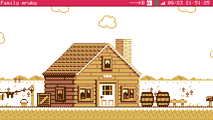

# Self Introduction

kishima

* Software Engineer
* ESP32 Hobbyist
* Family mruby Creator

# System Architecture

```fmrb
gfx = $fmrb_gfx
x = $fmrb_x
y = $fmrb_y
w = $fmrb_w

layers = [
  [0xE0, "User App (Ruby/Lua/BASIC)"],
  [0x1C, "Family mruby OS (Ruby)"],
  [0x03, "PicoRuby / mruby VM"],
  [0x49, "ESP32-S3 + ESP32-WROVER"],
]
bh = 14
layers.each_with_index do |layer, i|
  gfx.fill_rect(x, y + i * (bh + 2), w, bh, layer[0])
  tx = x + (w - layer[1].length * 6) / 2
  gfx.draw_text(tx, y + i * (bh + 2) + 3, layer[1], 0xFF, layer[0])
end
$fmrb_y = y + layers.length * (bh + 2) + 4
```

{::wait/}

**Two MCUs working together via UART**

# Hardware Specs

```fmrb
gfx = $fmrb_gfx
x = $fmrb_x
y = $fmrb_y
w = $fmrb_w
theme = $fmrb_theme

headers = ["", "Core", "Graphics"]
col_w = w / 3
gfx.fill_rect(x, y, w, 10, 0x03)
headers.each_with_index do |h, i|
  gfx.draw_text(x + i * col_w + 4, y + 1, h, 0xFC, 0x03)
end
gfx.draw_line(x, y + 10, x + w, y + 10, 0x60)

rows = [
  ["MCU", "ESP32-S3", "ESP32-WROVER"],
  ["RAM", "8MB PSRAM", "4MB PSRAM"],
  ["Flash", "16MB", "4MB"],
  ["Output", "USB Host", "NTSC + I2S"],
  ["Link", "UART 921600bps", "UART 921600bps"],
]
rows.each_with_index do |row, ri|
  ry = y + 12 + ri * 10
  bg = ri % 2 == 0 ? 0x00 : 0x24
  gfx.fill_rect(x, ry, w, 10, bg)
  row.each_with_index do |cell, ci|
    gfx.draw_text(x + ci * col_w + 4, ry + 1, cell, 0xFF, bg)
  end
end
$fmrb_y = y + 12 + rows.length * 10 + 4
```

# Features

- **Multi-VM** support
  - mruby (Ruby)
  - Lua
  - BASIC
- NTSC video output
- NES APU `audio`

{::wait/}

**All running on ESP32-S3!**

# Graphics System

- LovyanGFX rendering
- 320x240 `RGB332`
- PNG image support



{::wait/}

> Canvas layering with z-order

{::wait/}

> Multiple canvases composited

# Memory Layout

```fmrb
gfx = $fmrb_gfx
x = $fmrb_x
y = $fmrb_y
w = $fmrb_w

regions = [
  [80, 0x03, "Kernel (512KB)"],
  [80, 0x1C, "System App (512KB)"],
  [50, 0xE0, "User App 0 (512KB)"],
  [50, 0xFC, "User App 1 (512KB)"],
  [30, 0x49, "Log Buffer"],
]
total_h = 0
regions.each { |r| total_h += r[0] }
scale = 100.0 / total_h

regions.each do |region|
  h = (region[0] * scale).to_i
  h = 8 if h < 8
  gfx.fill_rect(x, y, w, h, region[1])
  gfx.draw_rect(x, y, w, h, 0x60)
  gfx.draw_text(x + 4, y + (h - 8) / 2, region[2], 0xFF, region[1])
  y += h
end
$fmrb_y = y + 4
```

# Code Example

```
class Hello < FmrbApp
  def on_create
    @gfx.clear(0x03)
    @gfx.draw_text(10, 10, "Hello!", 0xFF)
    @gfx.present
  end
end
```

# Goals

1. Run rich embedded apps with mruby
2. Build a tiny computer with Ruby

{::wait/}

3. **The best platform for learning**

{::wait/}

- No complex OS needed
- Just a TV and a keyboard
- Fully hackable and open source

# Audio System

**NSF Player** can play `.nsf` files

The APU emulator supports:

1. Pulse 1 channel
2. Pulse 2 channel
3. Triangle channel
4. Noise channel

# Thank you!

Family mruby OS

{:.center}

`github.com/family-mruby`

{:.center}

**See you at RubyKaigi 2026!**

{:.center}
